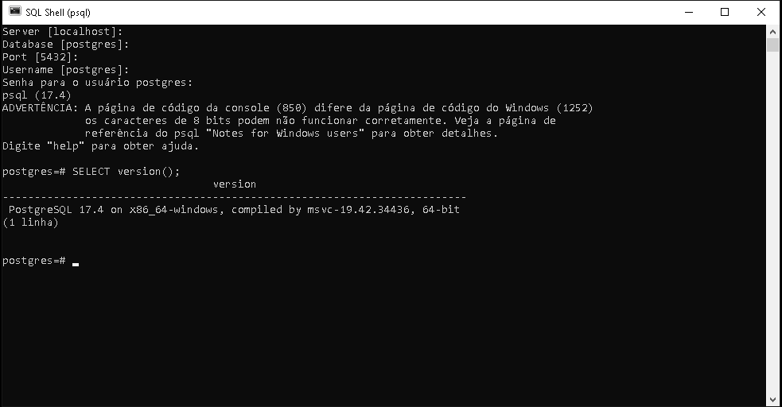

# Guia de Referência Rápida

## Ambiente

### Como verificar a versão da base PostgreSQL

Verificando versão

- Acesse o serviço através do SSH.
- Depois de acessar, conecte-se em sua base utilizando o comando:

```bash
psql -h [HOST] -U [USUARIODOBANCO] -W
```

Ex.: psql -h postgresql01.meudominio.com.br -U cliente -W

- Em seguida, será solicitada a senha do banco de dados.
- Depois de se conectar, execute o comando abaixo:

```sql
SELECT version();
```

Pronto!

A versão do PostgreSQL será apresentada.



---

## Comandos DDL - Data Definition Language ou Linguagem de Definição de Dados

### Criar um Banco de Dados

Comando mais simples para criação de umm Banco de Dados

```sql
CREATE DATABASE nome_database;
```

### Excluir um Banco de Dados

Comando para exclusão de um Banco de Dados

```sql
DELETE DATABASE nome_database;
```

## Criar uma Tabela

To create a table, you use the aptly named [CREATE TABLE](https://www.postgresql.org/docs/17/sql-createtable.html) command. In this command you specify at least a name for the new table, the names of the columns and the data type of each column. For example:

```sql
CREATE TABLE my_first_table (
    first_column text,
    second_column integer
);
```

This creates a table named `my_first_table` with two columns. The first column is named `first_column` and has a data type of `text`; the second column has the name `second_column` and the type `integer`. The table and column names follow the identifier syntax explained in [Section 4.1.1](https://www.postgresql.org/docs/17/sql-syntax-lexical.html#SQL-SYNTAX-IDENTIFIERS). The type names are usually also identifiers, but there are some exceptions. **Note that the column list is comma-separated and surrounded by parentheses**.

Of course, the previous example was heavily contrived. Normally, you would give names to your tables and columns that convey what kind of data they store. So let's look at a more realistic example:

```sql
CREATE TABLE products (
    product_no integer,
    name text,
    price numeric
);
```

## Excluir uma tabela

If you no longer need a table, you can remove it using the DROP TABLE command. For example:

```sql
DROP TABLE my_first_table;
DROP TABLE products;
```

Attempting to drop a table that does not exist is an error. Nevertheless, it is common in SQL script files to unconditionally try to drop each table before creating it, ignoring any error messages, so that the script works whether or not the table exists. (If you like, you can use the DROP TABLE IF EXISTS variant to avoid the error messages, but this is not standard SQL.)

---

## Faça como eu fiz

Nesta etapa, o instrutor sugere que você siga todos os passos apresentados ao longo da aula. É essencial reproduzir as ações demonstradas nos vídeos para consolidar o aprendizado e avançar com segurança para a próxima etapa.

Este documento reflete minha aplicação prática dos conceitos aprendidos.

---

## Projeto da aula

Aqui são fornecidos os scripts utilizados pelo instrutor ao logo da aula:

- [Aula01-atividade03.sql](./src/Aula01-atividade03.sql)
- [Aula01-atividade05.sql](./src/Aula01-atividade05.sql)

---

## O que aprendemos

Nesta aula, aprendemos:

- Como instalar o PostgreSQL e o pgAdmin
- Como conectar ao PostgreSQL, utilizando o terminal e o pgAdmin
- A criar o banco de dados pelo terminal e pelo pgAdmin
- Como apagar o banco de dados pelo terminal e pelo pgAdmin
- A criar tabela com os tipos de dados mais comuns:
  - SERIAL
  - VARCHAR
  - CHAR
  - TEXT
  - INTEGER
  - NUMERIC
  - BOOLEAN
  - DATE
  - TIME
  - TIMESTAMP

---

## Fim do Módulo

---
