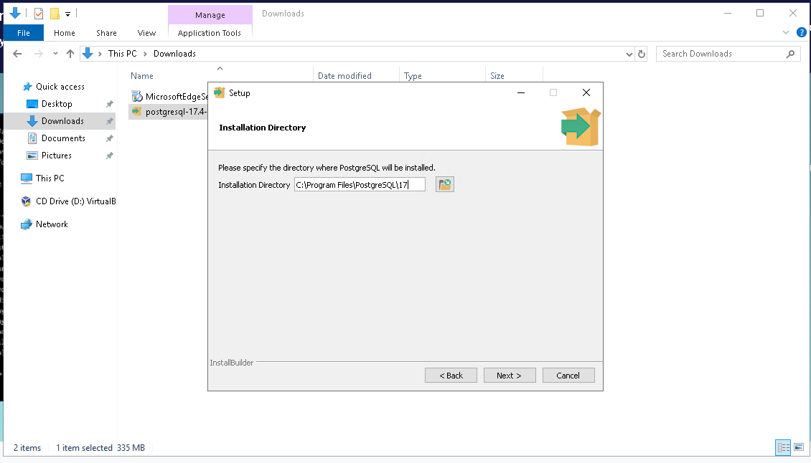
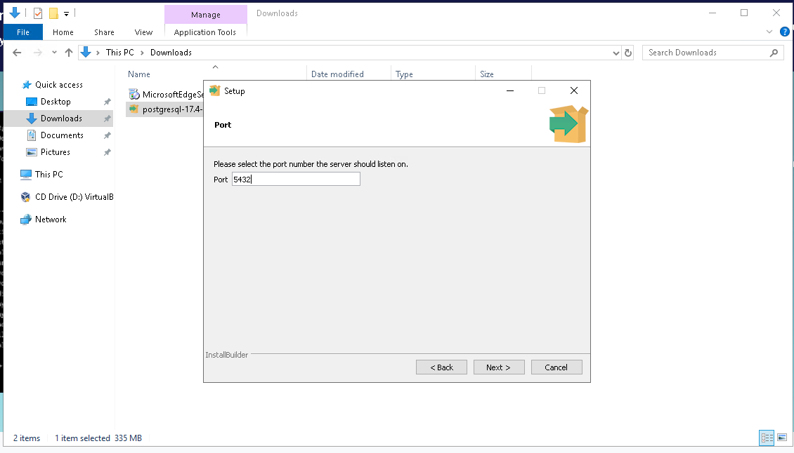
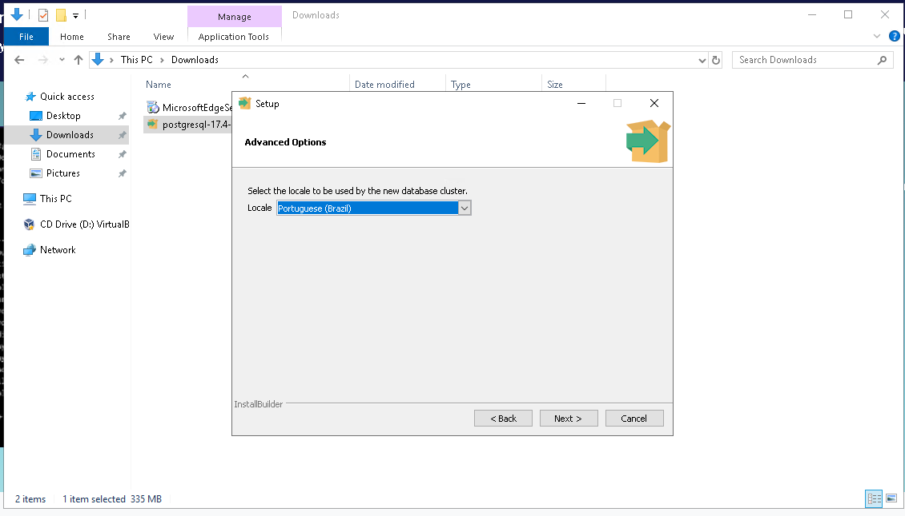
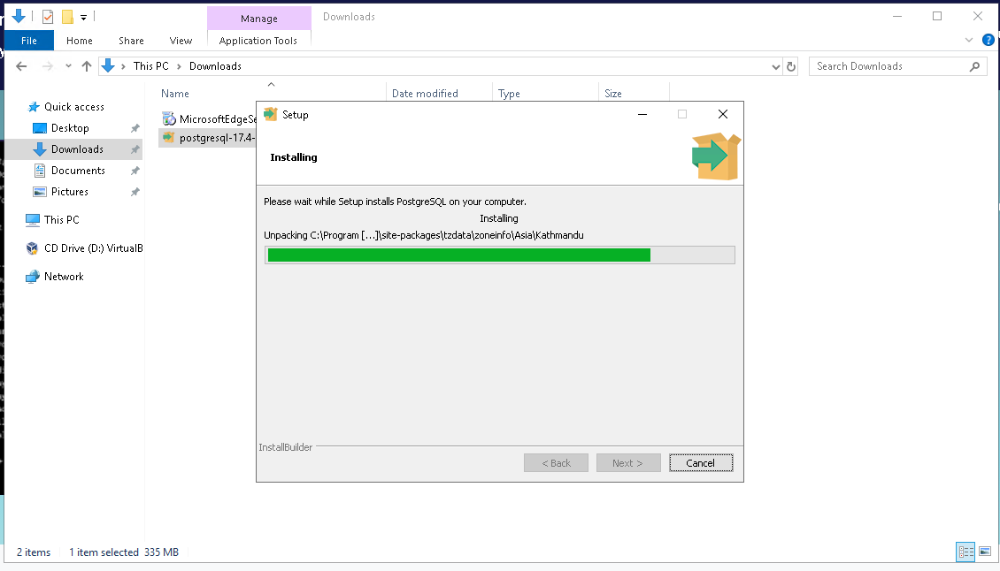
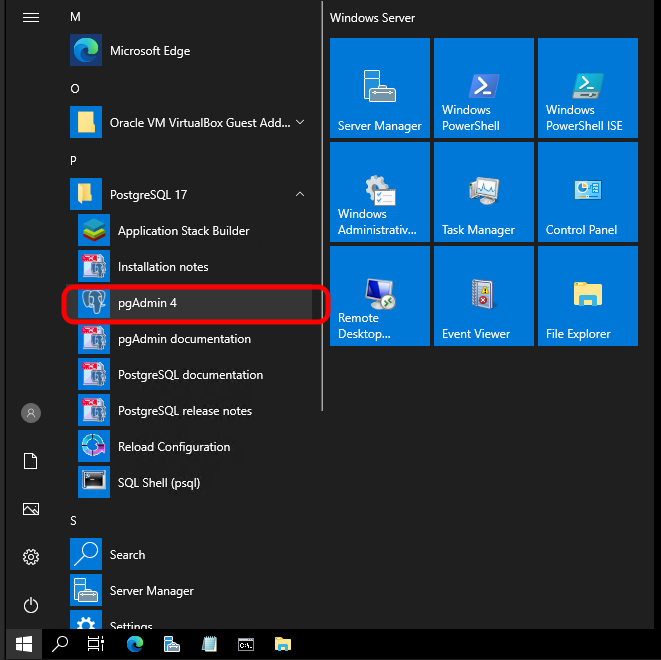
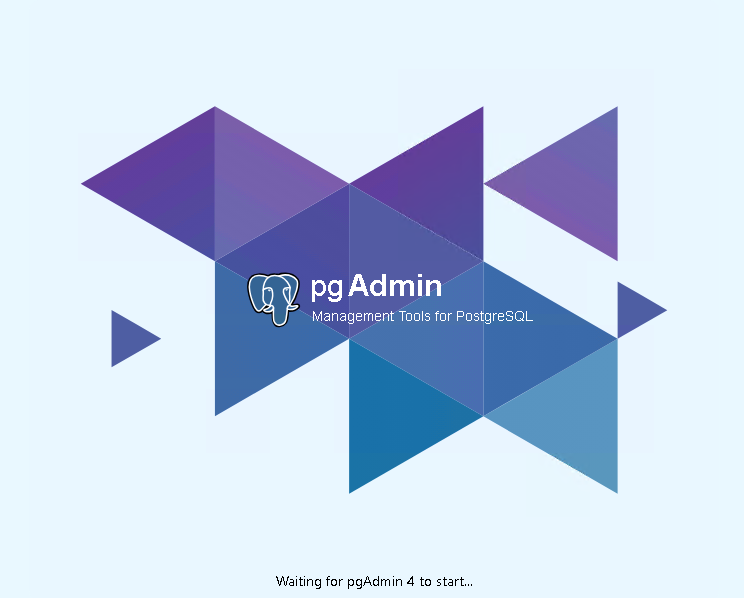
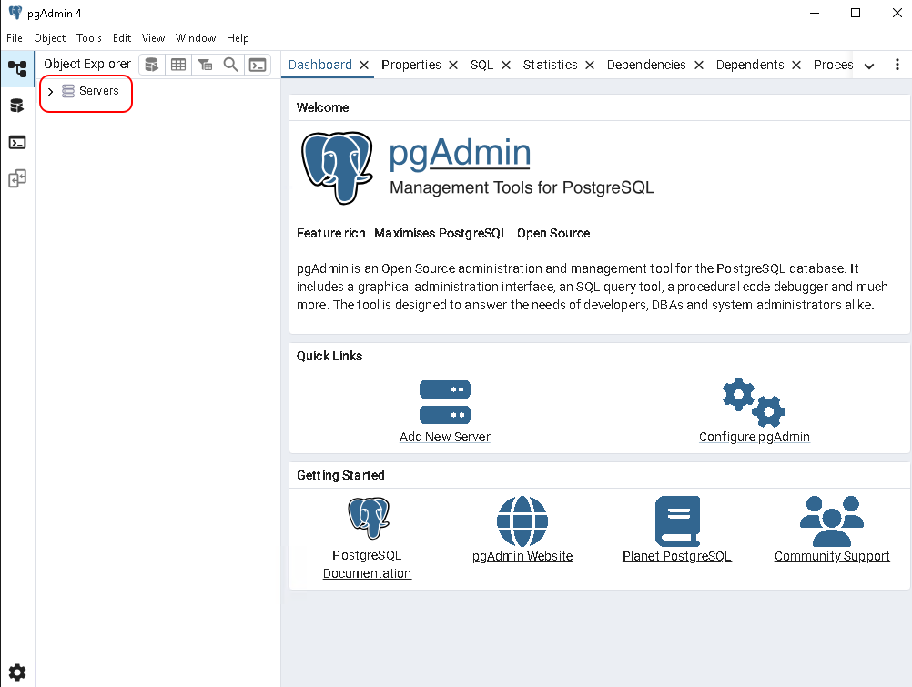
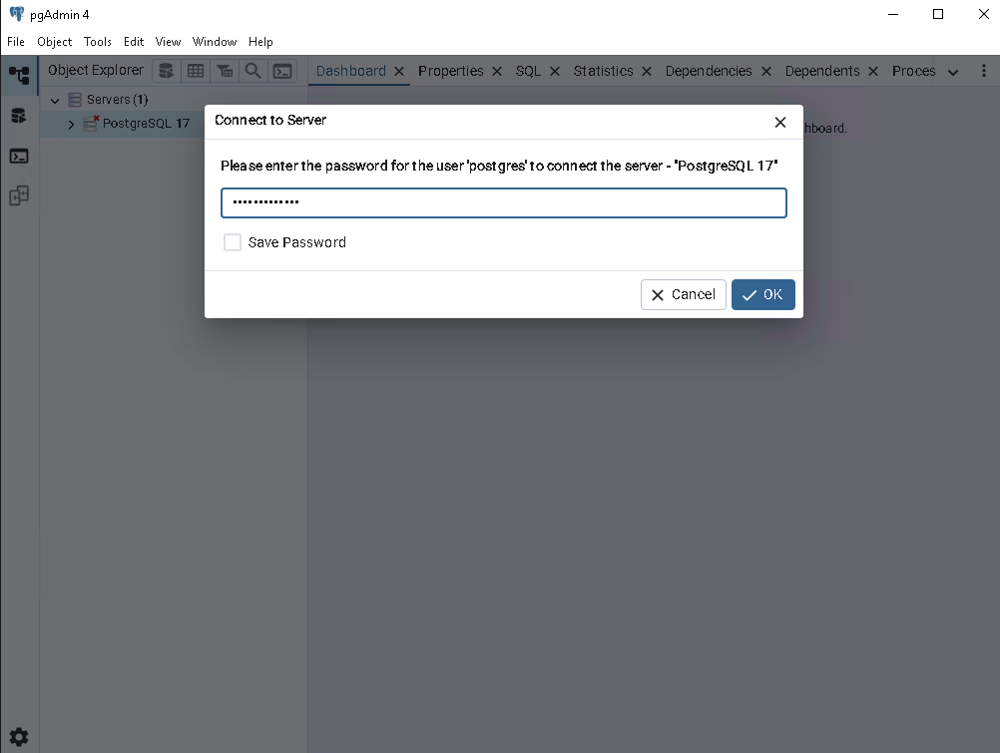
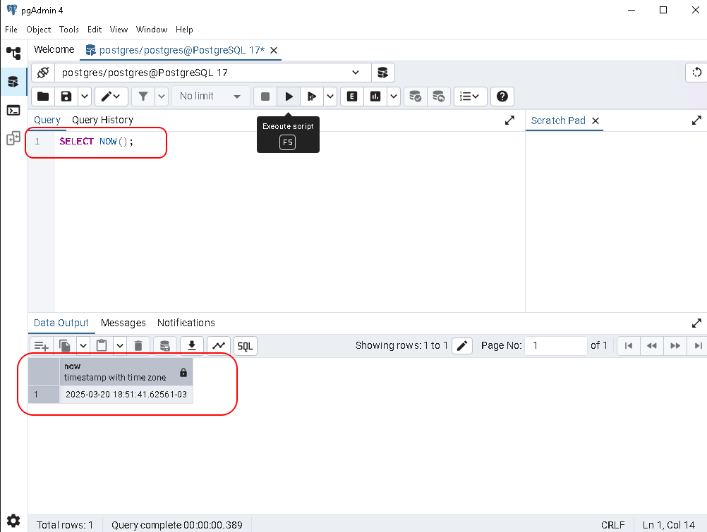
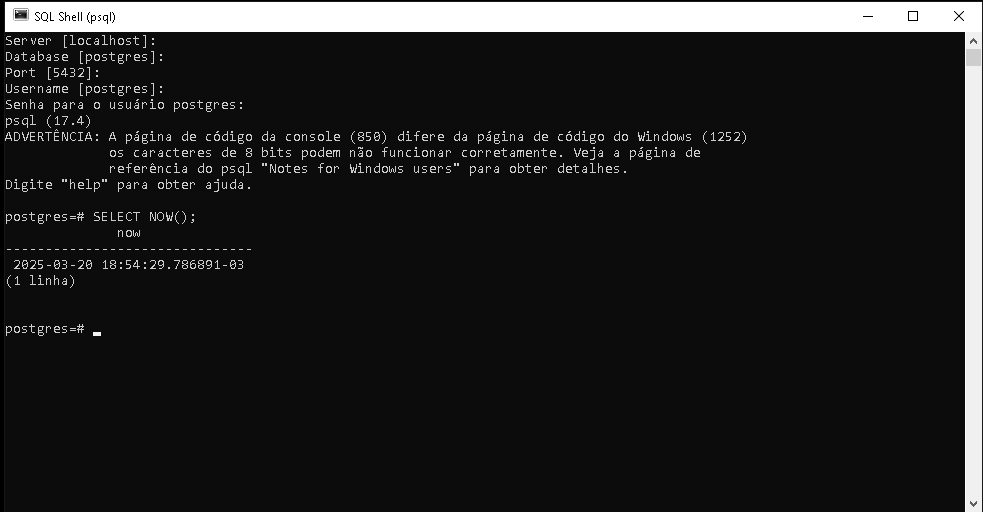

# Alura - PostgreSQL: Primeiros passos com SQL

## Apresentação ao curso

O nosso objetivo neste curso é apresentar uma introdução às principais funções que você pode utilizar nesse poderoso banco de dados relacional open source.

[Site oficial do PostgreSQL](https://www.postgresql.org/)

## Ambiente e versões

Nosso primeiro passo para utilizar o PostgreSQL é fazer a instalação dele na nossa máquina. Para isso, acesse a página de Downloads, onde você deve clicar escolher a versão para o seu sistema operacional.

A versão atual do PostgreSQL, no momento dos nossos estudos é a versão 17.2, porém a versão utilizada no treinamento é a versão 12.9 a qual é recomendada para uma experiência mais próxima às demonstrações do instrutor.

[Página de Downloads do PostgreSQL](https://www.postgresql.org/download/)

### Instalação Windows

Ao realizar o download, execute o programa de instalação, confirme o local de instalação sugerido, assim como deixar marcado "todos" componentes sugeridos para instalação:

- PostgreSQL Server
- pgAdmin 4
- Stack Builder
- Command Line Tools

Confirme também o local para os arquivos de dados sugerido, defina uma senha para o usuário `root`, confime a porta padrão que o PostgreSQL irá utilizar, defina o Locale a ser utilizado `Portuguese, Brazil`, em seguida confirme para que a instalação seja inicializada.

### Sequência de telas da instalação realizada

Execute o arquivo baixado

Clique em `Next`

Confirme o local de instalação

Confirme a escolha dos componentes (conforme sugerido anteriormente)

Confirme o local para os arquivos de dados

Informe a senha que será utilizada para o usuário `root` do postgres

Confirme a porta padrão ou altere caso necessário

Defina o Locale a ser utilizado `Portuguese, Brazil`

Um resumo da instalação a ser realizada é mostrado

Clique em `Next`

A instalação é iniciada, aguarde

Desmarque a opção "Stack Builder may be used to download and install additional tools" e clique em `Finish`

Execute o SQL Shell (psql)

Após a conclusão da instalação faremos alguns testes para certificar-se que a mesma foi bem sucedida.

### Utilizando o programa _SQL Shell (psql)_

Assim que o programa for iniciado, pressione `enter`para confirmar às seguintes perguntas:

- Server [localhost]:
- Database [postgres]:
- Port [5432]:
- Username [postgres]:
- Password for user postgres: "Aqui você deve informar a senha que definiu no momento da instalação"

Saída esperada:

Se chegou até aqui significa que conseguiu se conectar ao banco de dados.

---

### Utilizando o programa _pgAdmin_

Agora faremos o mesmo processo, mas utilizando o `pgAdmin`.

Execute o `pgAdmin`

Aguarde o carregamento do programa

Clique em `Servers`

Informe a senha para o usuário do `postgres`

O Object Explorer é carregado e o Database `postgres` é mostrado, clique em `Query Tool`

Na janela de `Query` digite o comando, neste exemplo: `SELECT NOW();` em seguida clique em `Execute script` e veja o resultado

Mesmo resultado executando o comando anterior no `SQL Shell (psql)`

