# Alura - PostgreSQL: Primeiros passos com SQL

## Apresentação ao curso

O nosso objetivo neste curso é apresentar uma introdução às principais funções que você pode utilizar nesse poderoso banco de dados relacional open source.

[Site oficial do PostgreSQL](https://www.postgresql.org/)

## Ambiente e versões

Nosso primeiro passo para utilizar o PostgreSQL é fazer a instalação dele na nossa máquina. Para isso, acesse a página de Downloads, onde você deve clicar escolher a versão para o seu sistema operacional.

A versão atual do PostgreSQL, no momento dos nossos estudos é a versão 17.2, porém a versão utilizada no treinamento é a versão 12.9 a qual é recomendada para uma experiência mais próxima às demonstrações do instrutor.

[Página de Downloads do PostgreSQL](https://www.postgresql.org/download/)

### Instalação no Windows

#### Dados de Configuração (Windows)

- SO: **Windows Server 2019 Evalution Edition**
- Host: **LAB-PSL-VMWSV01**
- Name: **Windows Server for Laboratory PostgreSQL**
- Username: **USERNAME**
- Password: **SENHA_FORTE**
- RDP: **enable**
- RDP Port: **53389**
- IP: **192.168.0.191**
- Obs.: **Clonado de "Clone de LAB-yyy-VMSV01" (sem atualizações/instalações adicionais)**

Ao realizar o download, execute o programa de instalação, confirme o local de instalação sugerido, assim como deixar marcado "todos" componentes sugeridos para instalação:

- PostgreSQL Server
- pgAdmin 4
- Stack Builder
- Command Line Tools

Confirme também o local para os arquivos de dados sugerido, defina uma senha para o usuário `root`, confime a porta padrão que o PostgreSQL irá utilizar, defina o Locale a ser utilizado `Portuguese, Brazil`, em seguida confirme para que a instalação seja inicializada.

### Sequência de telas da instalação realizada

Execute o arquivo baixado

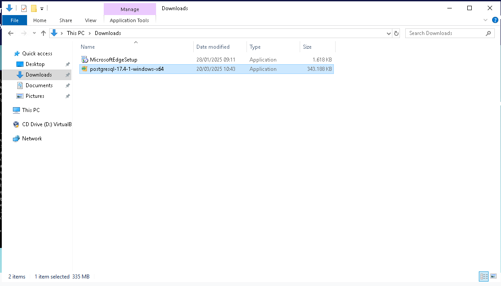

Clique em `Next`

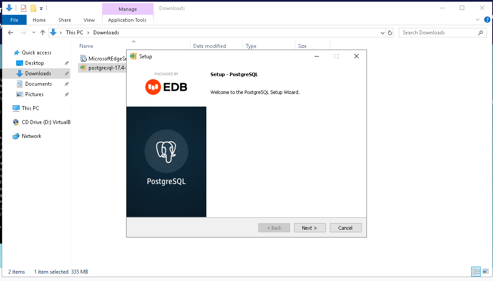

Confirme o local de instalação


Confirme a escolha dos componentes (conforme sugerido anteriormente)

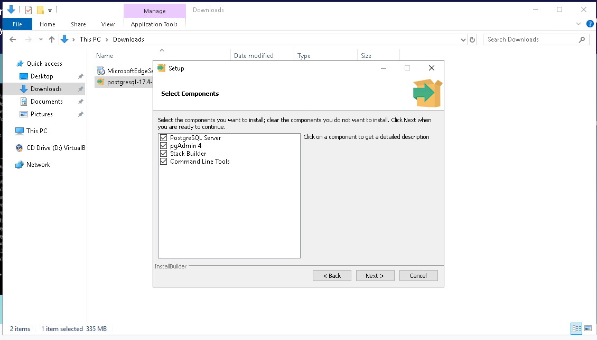

Confirme o local para os arquivos de dados


Informe a senha que será utilizada para o usuário `root` do postgres

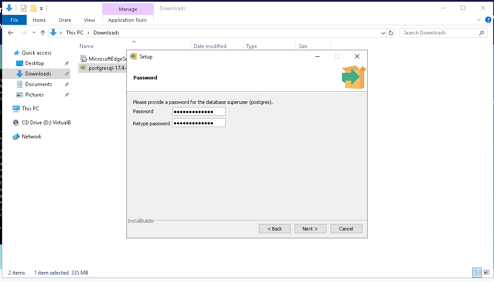

Confirme a porta padrão ou altere caso necessário


Defina o Locale a ser utilizado `Portuguese, Brazil`


Um resumo da instalação a ser realizada é mostrado

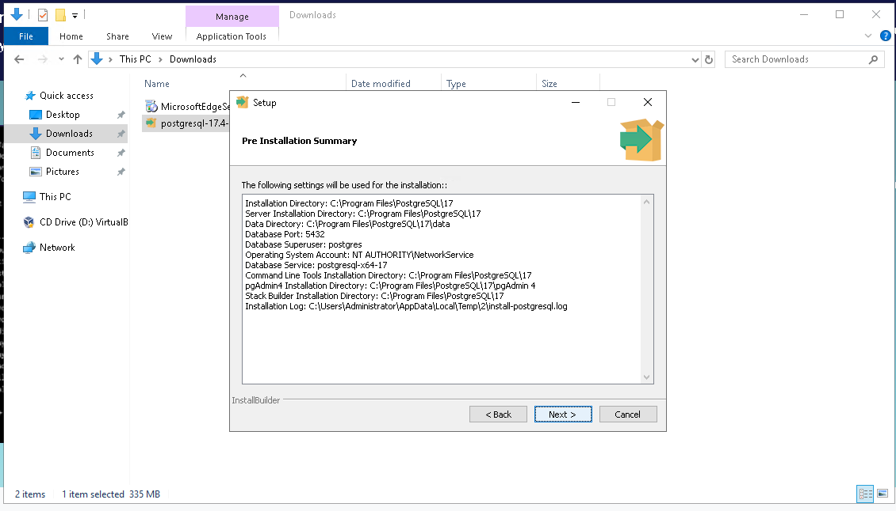

Clique em `Next`

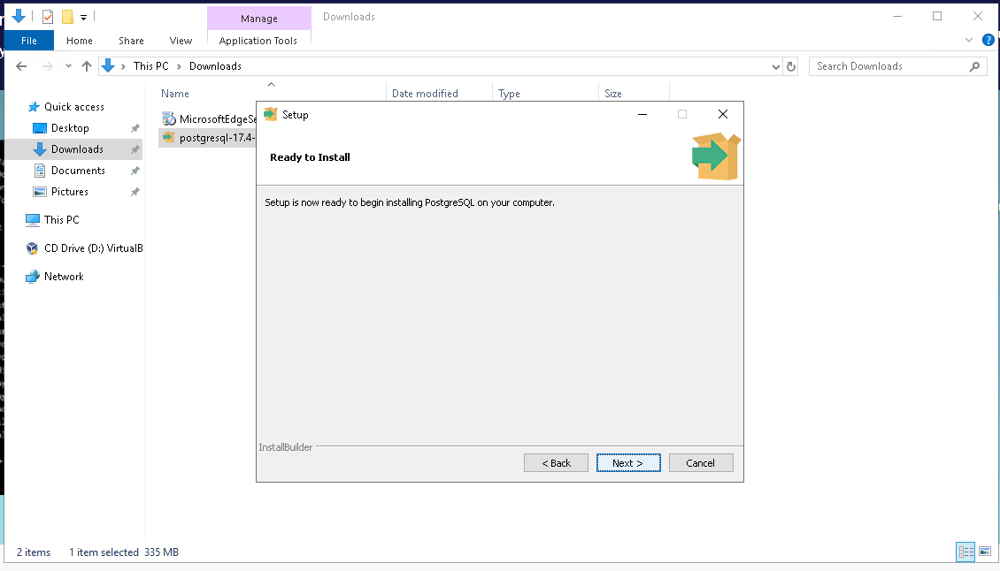

A instalação é iniciada, aguarde


Desmarque a opção "Stack Builder may be used to download and install additional tools" e clique em `Finish`

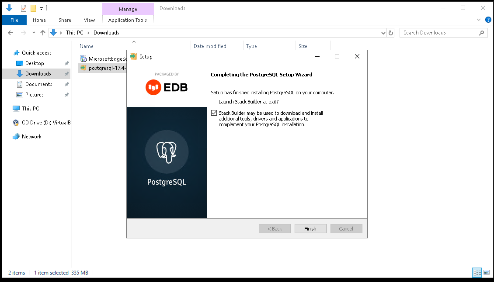

Execute o SQL Shell (psql)

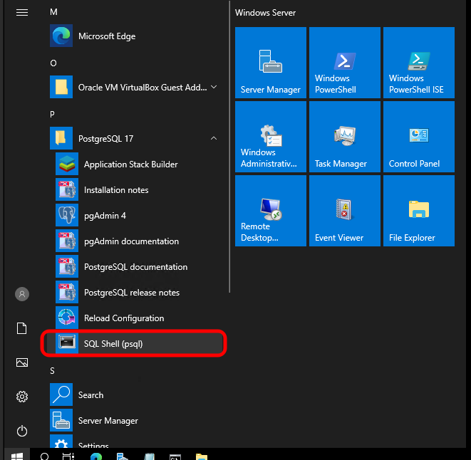

Após a conclusão da instalação faremos alguns testes para certificar-se que a mesma foi bem sucedida.

### Utilizando o programa _SQL Shell (psql)_

Assim que o programa for iniciado, pressione `enter`para confirmar às seguintes perguntas:

- Server [localhost]:
- Database [postgres]:
- Port [5432]:
- Username [postgres]:
- Password for user postgres: "Aqui você deve informar a senha que definiu no momento da instalação"

Saída esperada:

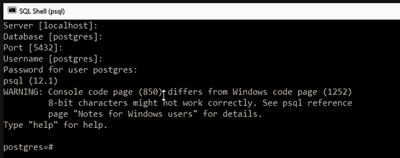

Se chegou até aqui significa que conseguiu se conectar ao banco de dados.

---

### Utilizando o programa _pgAdmin_

Agora faremos o mesmo processo, mas utilizando o `pgAdmin`.

Execute o `pgAdmin`


Aguarde o carregamento do programa


Clique em `Servers`


Informe a senha para o usuário do `postgres`


O Object Explorer é carregado e o Database `postgres` é mostrado, clique em `Query Tool`

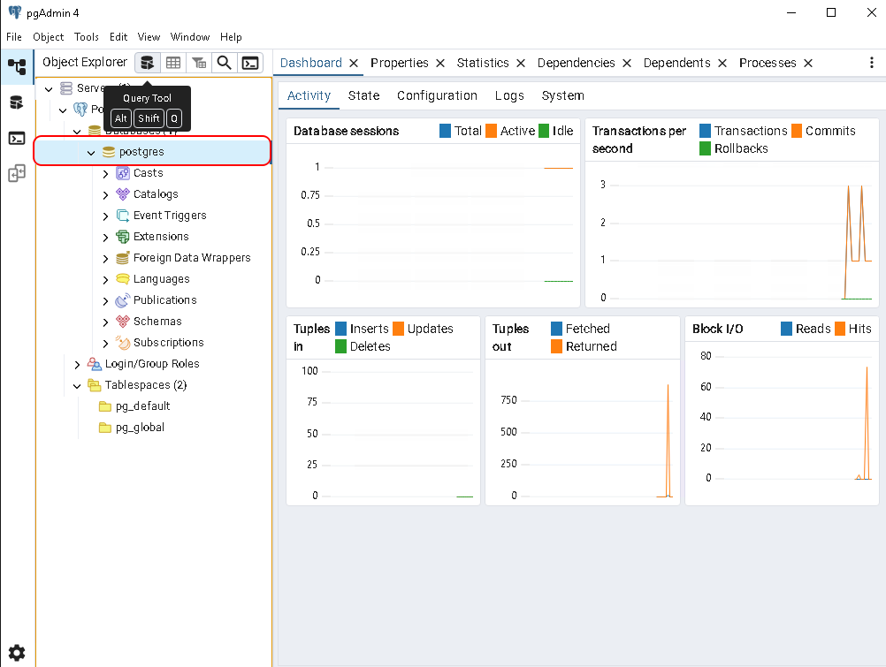

Na janela de `Query` digite o comando, neste exemplo: `SELECT NOW();` em seguida clique em `Execute script` e veja o resultado


Mesmo resultado executando o comando anterior no `SQL Shell (psql)`


---

### Instalação no Linux

#### Dados de Configuração (Linux)

- SO: **Ubuntu Server 24.04.1 LTS**
- Host: **LAB-PSL-VMLSV02**
- Name: **Ubuntu Server for Laboratory PostgreSQL**
- Username: **USERNAME**
- Password: **SENHA_FORTE**
- OpenSSH Server: **enable**
- SSH Port: **22**
- IP: **192.168.0.192**
- Obs.: **Clonado de "Clone de LAB-xxx-SRV01" (sem atualizações/instalações adicionais)**

### Instalação PostgreSQL 17

Realizei a instalação seguindo os passos disponibilizados na [documentação existente no site do PostgreSQL](https://www.postgresql.org/download/linux/ubuntu/)

```bash
# Import the repository signing key:
sudo apt install curl ca-certificates
sudo install -d /usr/share/postgresql-common/pgdg
sudo curl -o /usr/share/postgresql-common/pgdg/apt.postgresql.org.asc --fail https://www.postgresql.org/media/keys/ACCC4CF8.asc

# Create the repository configuration file:
sudo sh -c 'echo "deb [signed-by=/usr/share/postgresql-common/pgdg/apt.postgresql.org.asc] https://apt.postgresql.org/pub/repos/apt $(lsb_release -cs)-pgdg main" > /etc/apt/sources.list.d/pgdg.list'

# Update the package lists:
sudo apt update

# Install the latest version of PostgreSQL:
# If you want a specific version, use 'postgresql-16' or similar instead of 'postgresql'
sudo apt -y install postgresql
```

### O que esperar após a execução?

1. O Ubuntu irá:
   - Baixar os pacotes necessários do repositório oficial.
   - Configurar os arquivos principais do PostgreSQL.
   - Iniciar o serviço PostgreSQL.

2. O servidor PostgreSQL estará rodando e escutando na porta padrão (5432).

3. Um usuário padrão chamado `postgres` será criado, que tem permissões administrativas no banco de dados.

4. Você poderá se conectar ao PostgreSQL usando o comando:

   ```bash
   sudo -i -u postgres psql
   ```

### Passos adicionais recomendados

- **Verificar se o serviço está rodando**:

  ```bash
  sudo systemctl status postgresql
  ```

- **Verificar se o PostgreSQL está habilitado para restart automático**:
  Para isso use o comando:

  ```bash
  sudo systemctl is-enabled postgresql
  ```

  Você deve ter um retorno como `enabled`

- **Faça uma primeira conexão com o PostgreSQL**:
  Você precisa estar com o user `postgres` esse user é um superadmin:

  ```bash
  sudo su - postgres
  ```

  Em seguida conecte-se com o utilitário `psql`:

  ```bash
  psql
  ```

  Faça um teste utilizando a função conninfo para trazer o status:

  ```bash
  \conninfo
  ```

  Você deve ter um retorno como:
  
  ```text
  You are connected to database "postgres" as user "postgres" via socket in "/var/run/postgresql" at port "5432".
  ```

  Para encerrar a conexão:

  ```sql
  \q
  ```

---

## Criando um Banco de Dados

Podemos criar um Banco de Dados utilizando a ferramenta de linha de comando `psql` ou através do `pgAdmin`. Em um primeiro momento irei por uma questão de simplificação da documentação do meu aprendizado, registrar apenas os retornos das execuções realizadas através da linha de comando.

Começamos conectando ao `postgres`,  para isso execute:

```bash
sudo -i -u postgres psql
```

Após conectar digite o seguinte comando para criar um banco de dados chamado `alula`:

```sql
CREATE DATABASE alura;
```

Para verificarmos se o banco de dados foi criado, digite o seguinte comando:

```sql
\l
```

Saída esperada:

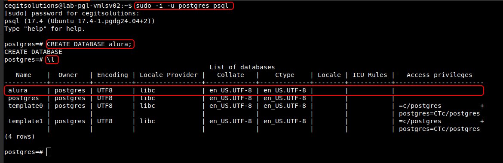

Realizar este processo pelo `pgAdmin` é muito semelhante ao `SSMS` do SQL Server, basta clicar com o botão direito em `Databases`, em seguida clicar em `Create Databases` uma janela para inserir as informações será exibida, complete e execute para que o banco de dados seja criado. Nesta mesma janela existe o botão `SQL` que ao ser clicado gera o script para que possa ser salvo ou utilizado no `psql`.

## Excluindo um Banco de Dados

Podemos excluir um Banco de Dados utilizando o seguinte comando:

```sql
DROP DATABASE alura;
```

---

## Criação e exclusão de um banco de dados - Testando conhecimento adquirido

João está praticando o trabalho com o banco de dados PostgreSQL, e ele quer criar um banco de dados para armazenar dados relacionados a um projeto de escola.

Ao tentar criar o banco de dados chamado escola, acabou criando o banco de dados chamado ecola. Quais comandos João deve executar para excluir o banco de dados criado com o nome errado e criar um novo banco de dados com o nome correto?

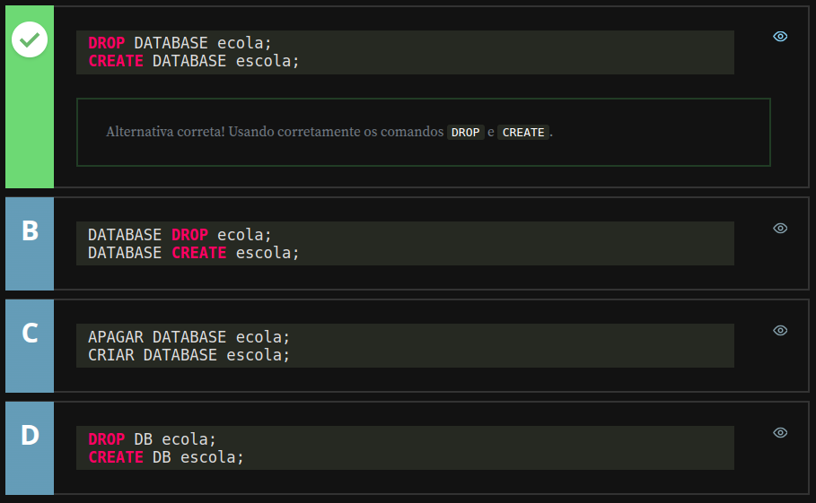

---

