# Alura - PostgreSQL: Primeiros passos com SQL

## Apresentação ao curso

O nosso objetivo neste curso é apresentar uma introdução às principais funções que você pode utilizar nesse poderoso banco de dados relacional open source.

[Site oficial do PostgreSQL](https://www.postgresql.org/)

## Ambiente e versões

Nosso primeiro passo para utilizar o PostgreSQL é fazer a instalação dele na nossa máquina. Para isso, acesse a página de Downloads, onde você deve clicar escolher a versão para o seu sistema operacional.

A versão atual do PostgreSQL, no momento dos nossos estudos é a versão 17.2, porém a versão utilizada no treinamento é a versão 12.9 a qual é recomendada para uma experiência mais próxima às demonstrações do instrutor.

[Página de Downloads do PostgreSQL](https://www.postgresql.org/download/)

### Instalação no Windows

#### Dados de Configuração (Windows)

- SO: **Windows Server 2019 Evalution Edition**
- Host: **LAB-PSL-VMWSV01**
- Name: **Windows Server for Laboratory PostgreSQL**
- Username: **USERNAME**
- Password: **SENHA_FORTE**
- RDP: **enable**
- RDP Port: **53389**
- IP: **192.168.0.191**
- Obs.: **Clonado de "Clone de LAB-yyy-VMSV01" (sem atualizações/instalações adicionais)**

Ao realizar o download, execute o programa de instalação, confirme o local de instalação sugerido, assim como deixar marcado "todos" componentes sugeridos para instalação:

- PostgreSQL Server
- pgAdmin 4
- Stack Builder
- Command Line Tools

Confirme também o local para os arquivos de dados sugerido, defina uma senha para o usuário `root`, confime a porta padrão que o PostgreSQL irá utilizar, defina o Locale a ser utilizado `Portuguese, Brazil`, em seguida confirme para que a instalação seja inicializada.

### Sequência de telas da instalação realizada

Execute o arquivo baixado


Clique em `Next`


Confirme o local de instalação


Confirme a escolha dos componentes (conforme sugerido anteriormente)

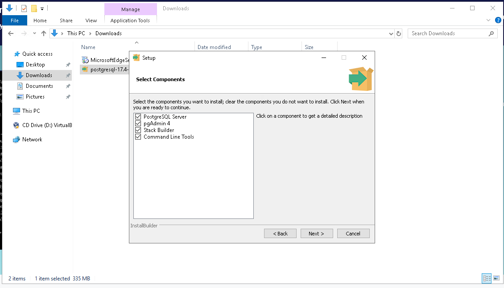

Confirme o local para os arquivos de dados

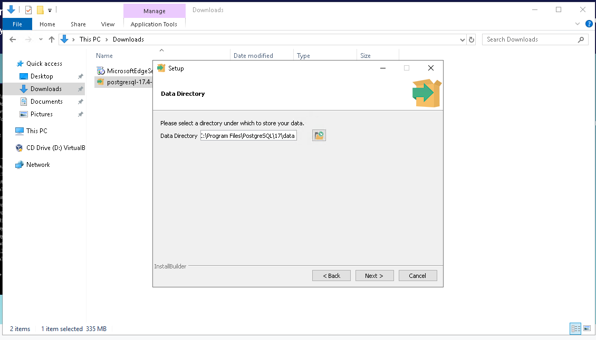

Informe a senha que será utilizada para o usuário `root` do postgres


Confirme a porta padrão ou altere caso necessário


Defina o Locale a ser utilizado `Portuguese, Brazil`


Um resumo da instalação a ser realizada é mostrado


Clique em `Next`

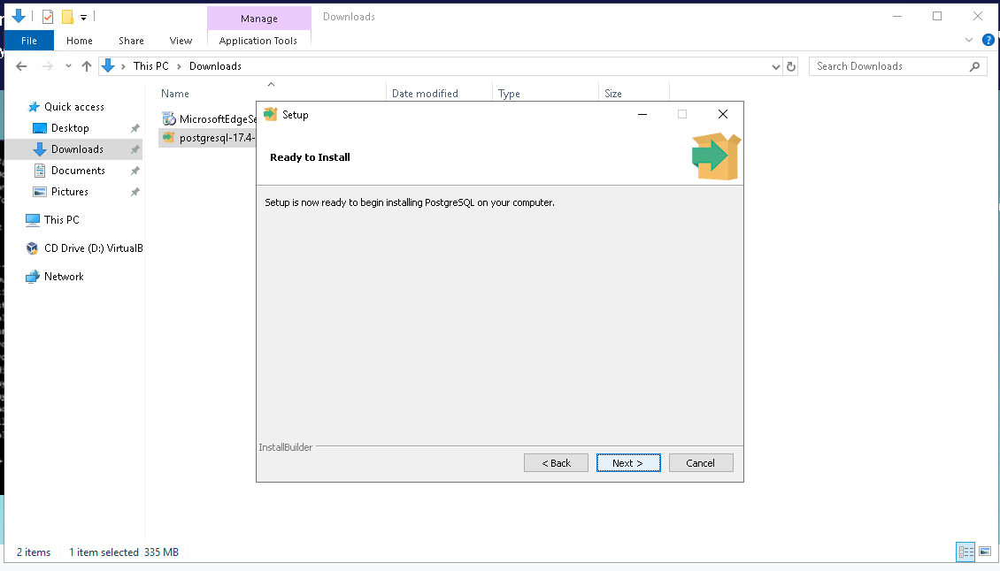

A instalação é iniciada, aguarde


Desmarque a opção "Stack Builder may be used to download and install additional tools" e clique em `Finish`


Execute o SQL Shell (psql)


Após a conclusão da instalação faremos alguns testes para certificar-se que a mesma foi bem sucedida.

### Utilizando o programa _SQL Shell (psql)_

Assim que o programa for iniciado, pressione `enter`para confirmar às seguintes perguntas:

- Server [localhost]:
- Database [postgres]:
- Port [5432]:
- Username [postgres]:
- Password for user postgres: "Aqui você deve informar a senha que definiu no momento da instalação"

Saída esperada:

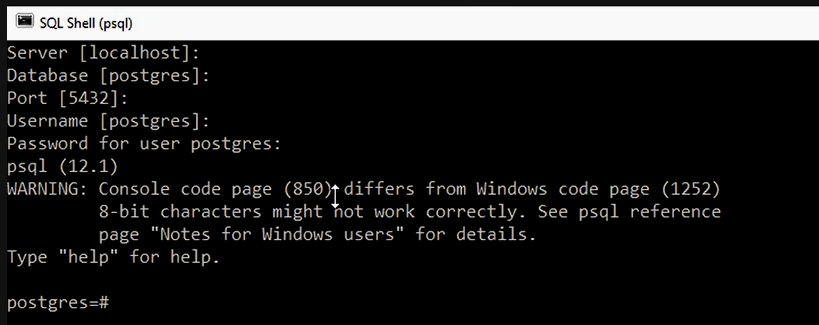

Se chegou até aqui significa que conseguiu se conectar ao banco de dados.

---

### Utilizando o programa _pgAdmin_

Agora faremos o mesmo processo, mas utilizando o `pgAdmin`.

Execute o `pgAdmin`

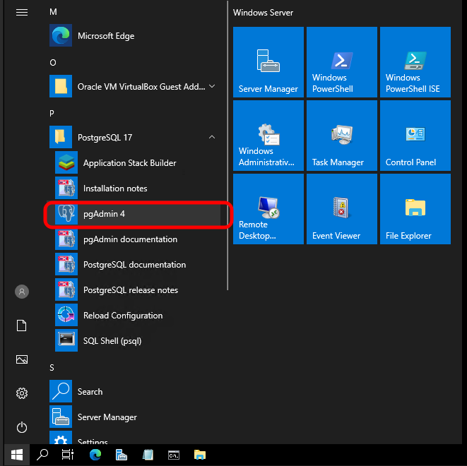

Aguarde o carregamento do programa


Clique em `Servers`


Informe a senha para o usuário do `postgres`

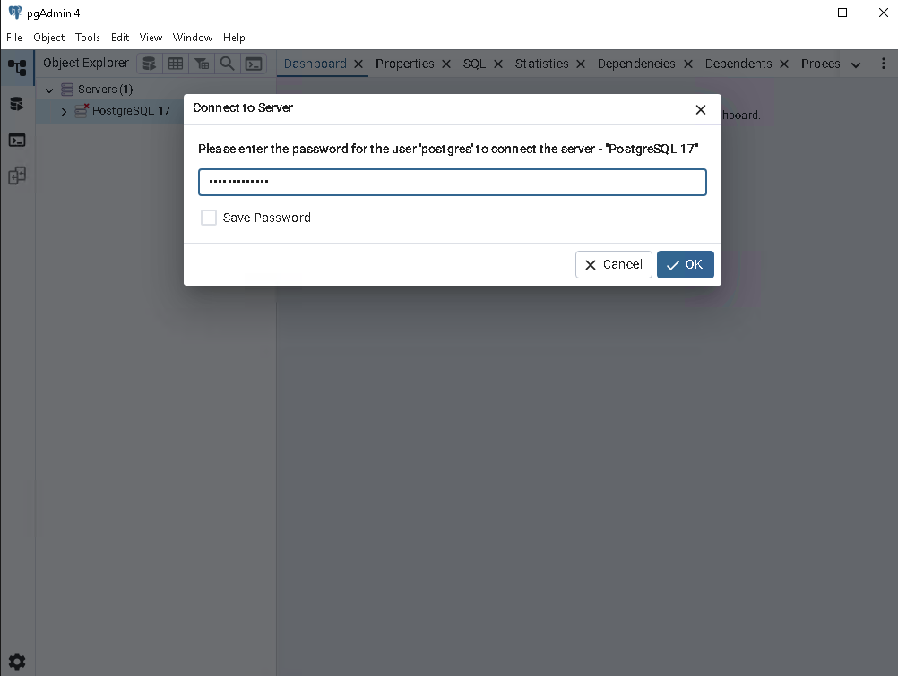

O Object Explorer é carregado e o Database `postgres` é mostrado, clique em `Query Tool`


Na janela de `Query` digite o comando, neste exemplo: `SELECT NOW();` em seguida clique em `Execute script` e veja o resultado

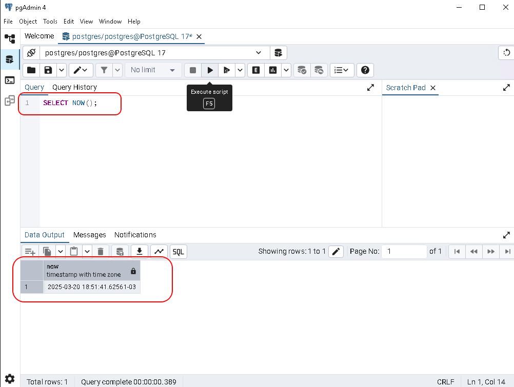

Mesmo resultado executando o comando anterior no `SQL Shell (psql)`

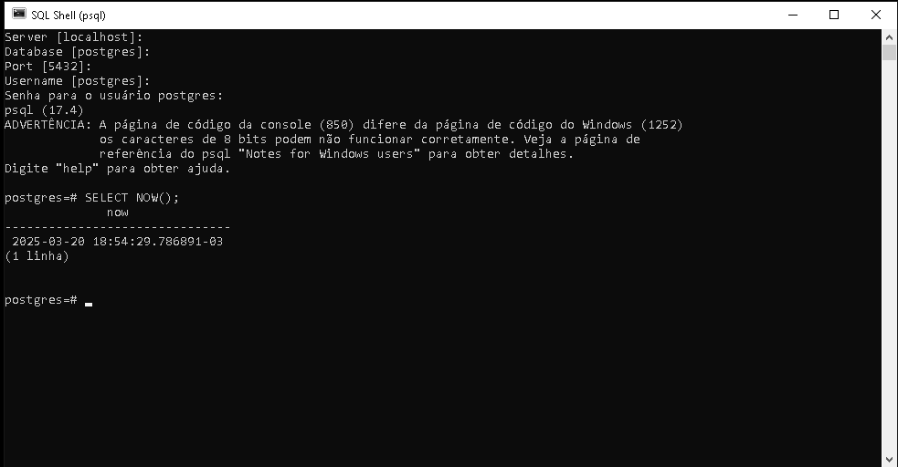

---

### Instalação no Linux

#### Dados de Configuração (Linux)

- SO: **Ubuntu Server 24.04.1 LTS**
- Host: **LAB-PSL-VMLSV02**
- Name: **Ubuntu Server for Laboratory PostgreSQL**
- Username: **USERNAME**
- Password: **SENHA_FORTE**
- OpenSSH Server: **enable**
- SSH Port: **22**
- IP: **192.168.0.192**
- Obs.: **Clonado de "Clone de LAB-xxx-SRV01" (sem atualizações/instalações adicionais)**

### Instalação PostgreSQL 17

Realizei a instalação seguindo os passos disponibilizados na [documentação existente no site do PostgreSQL](https://www.postgresql.org/download/linux/ubuntu/)

```bash
# Import the repository signing key:
sudo apt install curl ca-certificates
sudo install -d /usr/share/postgresql-common/pgdg
sudo curl -o /usr/share/postgresql-common/pgdg/apt.postgresql.org.asc --fail https://www.postgresql.org/media/keys/ACCC4CF8.asc

# Create the repository configuration file:
sudo sh -c 'echo "deb [signed-by=/usr/share/postgresql-common/pgdg/apt.postgresql.org.asc] https://apt.postgresql.org/pub/repos/apt $(lsb_release -cs)-pgdg main" > /etc/apt/sources.list.d/pgdg.list'

# Update the package lists:
sudo apt update

# Install the latest version of PostgreSQL:
# If you want a specific version, use 'postgresql-16' or similar instead of 'postgresql'
sudo apt -y install postgresql
```

### O que esperar após a execução?

1. O Ubuntu irá:
   - Baixar os pacotes necessários do repositório oficial.
   - Configurar os arquivos principais do PostgreSQL.
   - Iniciar o serviço PostgreSQL.

2. O servidor PostgreSQL estará rodando e escutando na porta padrão (5432).

3. Um usuário padrão chamado `postgres` será criado, que tem permissões administrativas no banco de dados.

4. Você poderá se conectar ao PostgreSQL usando o comando:

   ```bash
   sudo -i -u postgres psql
   ```

### Passos adicionais recomendados

- **Verificar se o serviço está rodando**:

  ```bash
  sudo systemctl status postgresql
  ```

- **Verificar se o PostgreSQL está habilitado para restart automático**:
  Para isso use o comando:

  ```bash
  sudo systemctl is-enabled postgresql
  ```

  Você deve ter um retorno como `enabled`

- **Faça uma primeira conexão com o PostgreSQL**:
  Você precisa estar com o user `postgres` esse user é um superadmin:

  ```bash
  sudo su - postgres
  ```

  Em seguida conecte-se com o utilitário `psql`:

  ```bash
  psql
  ```

  Faça um teste utilizando a função conninfo para trazer o status:

  ```bash
  \conninfo
  ```

  Você deve ter um retorno como:
  
  ```text
  You are connected to database "postgres" as user "postgres" via socket in "/var/run/postgresql" at port "5432".
  ```

  Para encerrar a conexão:

  ```sql
  \q
  ```

---

## Criando um Banco de Dados

Podemos criar um Banco de Dados utilizando a ferramenta de linha de comando `psql` ou através do `pgAdmin`. Em um primeiro momento irei por uma questão de simplificação da documentação do meu aprendizado, registrar apenas os retornos das execuções realizadas através da linha de comando.

Começamos conectando ao `postgres`,  para isso execute:

```bash
sudo -i -u postgres psql
```

Após conectar digite o seguinte comando para criar um banco de dados chamado `alura`:

```sql
CREATE DATABASE alura;
```

Para verificarmos se o banco de dados foi criado, digite o seguinte comando:

```sql
\l
```

Saída esperada:


Realizar este processo pelo `pgAdmin` é muito semelhante ao `SSMS` do SQL Server, basta clicar com o botão direito em `Databases`, em seguida clicar em `Create Databases` uma janela para inserir as informações será exibida, complete e execute para que o banco de dados seja criado. Nesta mesma janela existe o botão `SQL` que ao ser clicado gera o script para que possa ser salvo ou utilizado no `psql`.

## Excluindo um Banco de Dados

Podemos excluir um Banco de Dados utilizando o seguinte comando:

```sql
DROP DATABASE alura;
```

---

## Criação e exclusão de um banco de dados - Testando conhecimento adquirido

João está praticando o trabalho com o banco de dados PostgreSQL, e ele quer criar um banco de dados para armazenar dados relacionados a um projeto de escola.

Ao tentar criar o banco de dados chamado escola, acabou criando o banco de dados chamado ecola. Quais comandos João deve executar para excluir o banco de dados criado com o nome errado e criar um novo banco de dados com o nome correto?

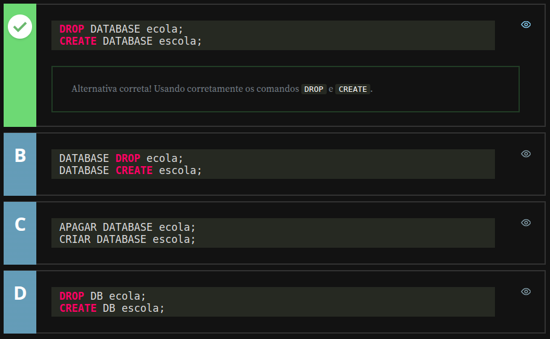

---

## Criando uma Tabela no PostgreSQL

Vamos aprender como criar tabelas no PostgreSQL, explorando os principais tipos de dados e suas aplicações. Isso nos ajudará a estruturar informações de forma eficiente em nossos bancos de dados.

Por exemplo, imagine um aluno da Alura, com dados como nome, RG, telefone e data de nascimento. Precisamos entender quais tipos de dados usar para armazenar essas informações.

Você pode encontrar uma lista completa dos tipos de dados no PostgreSQL neste [link](https://www.postgresql.org/docs/17/datatype.html). Vamos explorar os mais usados no dia a dia.

### Tipos Numéricos

Os tipos numéricos podem ser encontrados [nesta página](https://www.postgresql.org/docs/17/datatype-numeric.html). Os principais são:

- **integer**: Números inteiros entre -2147483648 e +2147483647.
- **real**: Números com até seis dígitos decimais.
- **serial**: Números inteiros positivos com incremento automático.
- **numeric**: Permite definir a precisão do número (quantidade de casas decimais).

### Tipos de Texto

Os campos de texto estão detalhados [nesta página](https://www.postgresql.org/docs/current/datatype-character.html). Eles incluem:

- **varchar(n)**: Ideal para textos com número de caracteres definido (ex.: nome de até 255 caracteres).
- **char(n)**: Para textos com número exato de caracteres (ex.: CPF com 11 caracteres). Atenção: espaços em branco podem ser adicionados para preencher o tamanho definido.
- **text**: Usado quando o tamanho do texto é desconhecido.

### Tipo Booleano

O tipo **boolean** é utilizado para valores **verdadeiros ou falsos**, como "ativo/inativo" ou "executado/não executado".

### Tipos de Data e Hora

Os tipos relacionados a data e hora estão descritos [nesta página](https://www.postgresql.org/docs/current/datatype-datetime.html). Eles incluem:

- **date**: Apenas a data.
- **time**: Apenas a hora.
- **timestamp**: Combinação de data e hora.

Basicamente utilizaremos os seguintes tipos de dados:

```sql
integer
real
serial
numeric

varchar(n)
char(n)
text

boolean

date
time
timestamp
```

Agora, na nossa simulação, vamos criar uma tabela para armazenar os dados de alunos. Para isso, utilizaremos o comando `CREATE TABLE aluno();`, abaixo da lista de tipos de dados.

Dentro dos parênteses dessa tabela, definiremos os campos e seus respectivos tipos de dados. Primeiramente, temos o **id** do aluno, que será do tipo `SERIAL`, permitindo incremento automático.

```sql
CREATE TABLE aluno(
    id SERIAL,
);
```

Em seguida, adicionaremos o campo para o nome do aluno, utilizando `nome VARCHAR(255)`, já que o nome pode ter de 0 a 255 caracteres. Também podemos incluir o campo de CPF, utilizando o tipo `CHAR(11)`, uma vez que sabemos que o CPF sempre terá exatamente 11 caracteres. Assim, usamos `cpf CHAR(11)`.

Outro campo interessante é o de observações, no qual simularemos um campo do tipo texto ilimitado. Para isso, usaremos `observacao TEXT`, que será útil para dados sem limite de caracteres. Adicionaremos também o campo **idade** para armazenar números inteiros, com o tipo `INTEGER`, uma vez que ele não requer casas decimais.

Para representar valores monetários, utilizamos o tipo `NUMERIC`, que permite precisão personalizada. Por exemplo: `dinheiro NUMERIC(10,2)`, onde `10` representa o total de dígitos (1234567890) e `2` as casas decimais (12345678,90). Além disso, podemos registrar a altura do aluno com o tipo `REAL`, que suporta valores numéricos com até seis casas decimais.

Assim, ficamos com os seguintes campos numéricos e de texto:

```sql
CREATE TABLE aluno(
    id SERIAL,
    nome VARCHAR(255),
    cpf CHAR(11),
    observacao TEXT,
    idade INTEGER,
    dinheiro NUMERIC(10,2),
    altura REAL,
);
```

Continuando, podemos usar o tipo `BOOLEAN` para registrar se o aluno está ativo ou não, como em `ativo BOOLEAN`. Para a data de nascimento, utilizaremos o tipo `DATE` (`data_nascimento DATE`).

Também podemos registrar o horário da aula com o tipo `TIME`, como em `hora_aula TIME`. Finalmente, para armazenar o momento da matrícula do aluno, utilizaremos o tipo `TIMESTAMP`, como em `matriculado_em TIMESTAMP`.

Com isso, a tabela completa para os dados dos alunos ficará assim:

```sql
CREATE TABLE aluno(
    id SERIAL,
    nome VARCHAR(255),
    cpf CHAR(11),
    observacao TEXT,
    idade INTEGER,
    dinheiro NUMERIC(10,2),
    altura REAL,
    ativo BOOLEAN,
    data_nascimento DATE,
    hora_aula TIME,
    matriculado_em TIMESTAMP
);
```

Utilizaremos o `pgAdmin` para criar essa tabela no banco de dados, depois de aberto, no Query Editor, digitamos o código, selecionamos e clicamos no botão de execução, como mostrado abaixo:

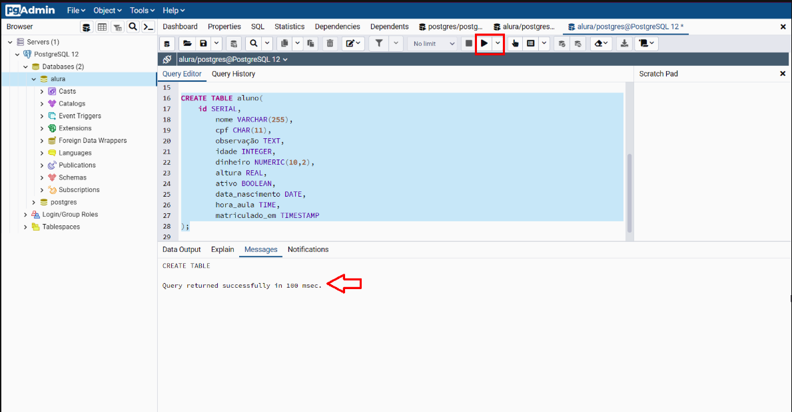

Vamos fazer um teste rápido para saber se a tabela está funcionando digitando o código `SELECT * FROM aluno;`, já que "aluno" é o nome da tabela. Mais uma vez selecionamos o código que queremos executar e clicamos no botão de execução para trazer os dados.

Com isso veremos a tabela, que agora está vazia, na guia Data output abaixo do editor de código, como mostrado abaixo:

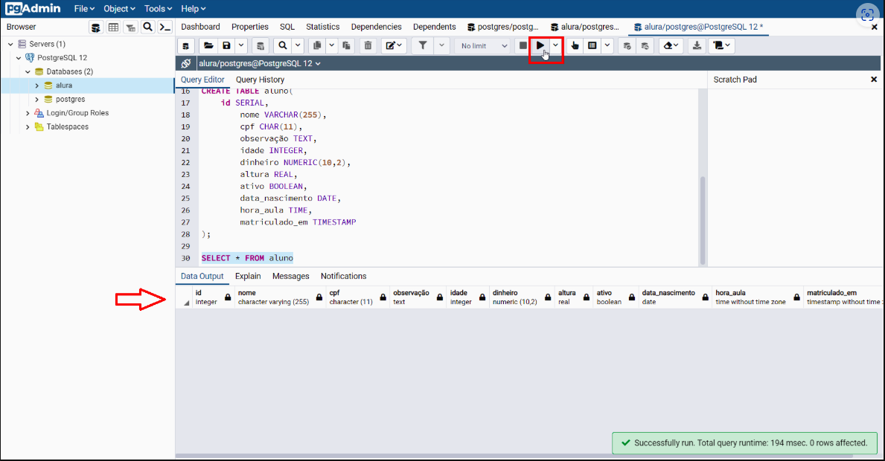

O mesmo processo, mas utilizando a ferramenta de linha de comando `psql`, pode ser observado abaixo:

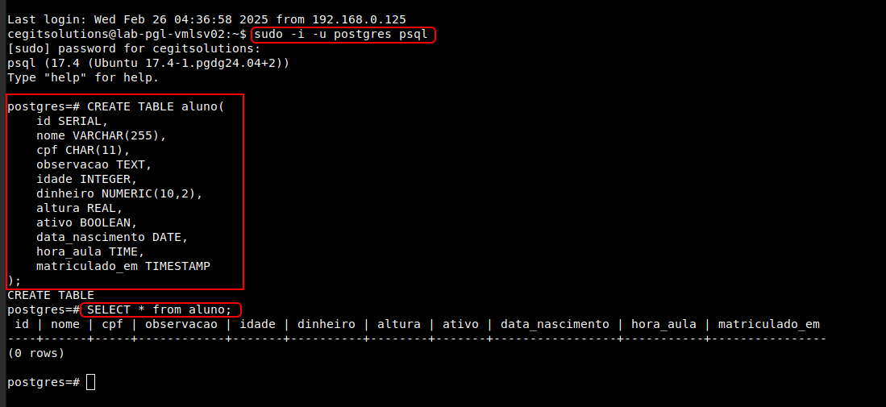

---

## Tabela de empresa - Testando conhecimento adquirido

Você está trabalhando em um projeto em que seus clientes precisam cadastrar alguns dados das empresas que são suas parceiras. Em uma reunião para definir quais dados os seus clientes precisam, ficou acordado as seguintes colunas:

Um identificador numérico, sem casas decimais, que deve ser incrementado automaticamente
O CNPJ
A razão social
O nome fantasia
A data de abertura da empresa
Qual das alternativas abaixo representa o comando SQL para criar a tabela que armazenará os dados das empresas?

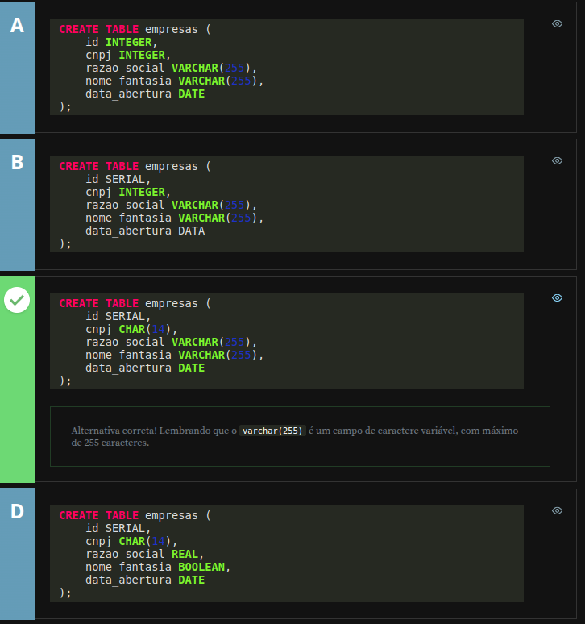

---

## Faça como eu fiz

Nesta etapa, o instrutor sugere que você siga todos os passos apresentados ao longo da aula. É essencial reproduzir as ações demonstradas nos vídeos para consolidar o aprendizado e avançar com segurança para a próxima etapa.

Este documento reflete minha aplicação prática dos conceitos aprendidos.

---

## Projeto da aula

Aqui são fornecidos os scripts utilizados pelo instrutor ao logo da aula:

- [Aula01-atividade03.sql](./src/Aula01-atividade03.sql)
- [Aula01-atividade05.sql](./src/Aula01-atividade05.sql)

---

## O que aprendemos

Nesta aula, aprendemos:

- Como instalar o PostgreSQL e o pgAdmin
- Como conectar ao PostgreSQL, utilizando o terminal e o pgAdmin
- A criar o banco de dados pelo terminal e pelo pgAdmin
- Como apagar o banco de dados pelo terminal e pelo pgAdmin
- A criar tabela com os tipos de dados mais comuns:
  - SERIAL
  - VARCHAR
  - CHAR
  - TEXT
  - INTEGER
  - NUMERIC
  - BOOLEAN
  - DATE
  - TIME
  - TIMESTAMP

---

## Fim do Módulo

---
