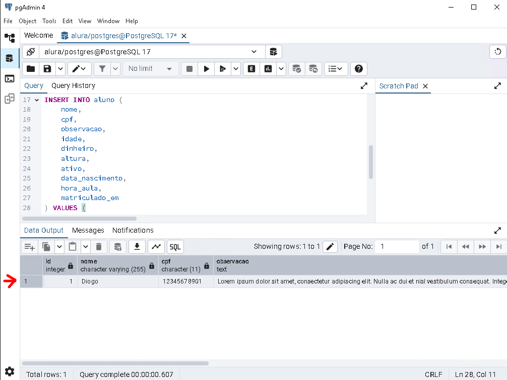
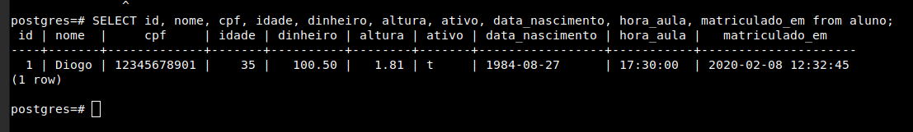

# Alura - PostgreSQL: Primeiros passos com SQL

## Executando operações CRUD

### Incluindo um registro na tabela

Agora que aprendemos a criar uma tabela no banco de dados e entendemos como funcionam os principais tipos de dados, é hora de aprender a incluir informações nessa tabela.

Começaremos com a sintaxe do comando `INSERT`. A tabela de exemplos do site oficial do PostgreSQL, acessível [aqui](https://www.postgresql.org/docs/current/sql-insert.html), contém detalhes sobre o uso desse comando. A sintaxe básica é a seguinte:

```sql
INSERT INTO table [ ( column [, ...] ) ]
    { DEFAULT VALUES | VALUES ( { expression | DEFAULT } [, ...] ) | query }
```

O comando começa com `INSERT INTO nome_da_tabela`, seguido pela declaração das colunas e valores. Os exemplos fornecidos ao final da página são bastante úteis para compreendermos o funcionamento.

No primeiro exemplo, vemos como incluir uma linha de dados declarando apenas os valores. Esse formato preenche todos os campos da tabela na sequência em que foram definidos:

```sql
INSERT INTO films VALUES
    ('UA502', 'Bananas', 105, '1971-07-13', 'Comedy', '82 minutes');
```

Porém, no dia-a-dia, utilizamos com mais frequência o modelo do segundo exemplo, onde especificamos as colunas a serem preenchidas:

```sql
INSERT INTO films (code, title, did, date_prod, kind)
    VALUES ('T_601', 'Yojimbo', 106, '1961-06-16', 'Drama');
```

Nesse formato, usamos `INSERT INTO nome_da_tabela`, declaramos as colunas, a string `VALUES` e seus respectivos valores. Vamos adotar esse modelo na aula.

### Exemplo prático: Incluindo registros na tabela `aluno`

A tabela `aluno` já foi criada, então o próximo passo é preencher seus campos. Começamos declarando o comando no pgAdmin:

```sql
INSERT INTO aluno();
```

Dentro dos parênteses, especificamos os campos a serem preenchidos. O campo `id` será incrementado automaticamente, então não precisa ser declarado. Iniciaremos com o campo `nome`, que aceita textos. Para incluir uma string, usamos aspas simples:

```sql
INSERT INTO aluno (
    nome
) VALUES (
    'Diogo'
);
```

Seguiremos com o campo `cpf`, que utiliza o tipo `CHAR(11)` e também requer uma string. Exemplo:

```sql
'12345678901'
```

O campo `observacao`, do tipo `TEXT`, pode armazenar textos maiores. Aqui utilizaremos um texto gerado pelo site [Lorem Ipsum](https://lipsum.com/), ajustado para uma única linha:

```sql
INSERT INTO aluno (
    nome,
    cpf,
    observacao
) VALUES (
    'Diogo',
    '12345678901',
    'Lorem ipsum dolor sit amet, consectetur adipiscing elit. Nulla ac dui et nisl vestibulum consequat. Integer vitae magna egestas, finibus libero dapibus, maximus magna. Fusce suscipit mi ut dui vestibulum, non vehicula felis fringilla.'
);
```

Agora, adicionaremos os campos restantes, incluindo:

- **idade (INTEGER)**: Para números inteiros, como `35`.
- **dinheiro (NUMERIC)**: Usamos o formato com ponto (`.`) para separação decimal, como `100.50`.
- **altura (REAL)**: Permite valores com ou sem casas decimais, como `1.81`.
- **ativo (BOOLEAN)**: Aceita `TRUE`, `FALSE` ou `NULL`, sendo `TRUE` para este exemplo.
- **data_nascimento (DATE)**: Usamos o formato `YYYY-MM-DD`, como `'1984-08-27'`.
- **hora_aula (TIME)**: Formatado como `HH24:MI:SS`, exemplo `'17:30:00'`.
- **matriculado_em (TIMESTAMP)**: Combina data e hora no formato `'YYYY-MM-DD HH24:MI:SS'`, exemplo `'2020-02-08 12:32:45'`.

### Finalizando os registros na tabela

Com todos os campos preenchidos, o comando final será:

```sql
INSERT INTO aluno (
    nome,
    cpf,
    observacao,
    idade,
    dinheiro,
    altura,
    ativo,
    data_nascimento,
    hora_aula,
    matriculado_em
) VALUES (
    'Diogo',
    '12345678901',
    'Lorem ipsum dolor sit amet, consectetur adipiscing elit. Nulla ac dui et nisl vestibulum consequat. Integer vitae magna egestas, finibus libero dapibus, maximus magna. Fusce suscipit mi ut dui vestibulum, non vehicula felis fringilla.',
    35,
    100.50,
    1.81,
    TRUE,
    '1984-08-27',
    '17:30:00',
    '2020-02-08 12:32:45'
);
```

Execute o código no pgAdmin e, em seguida, use o comando abaixo para verificar os dados incluídos na tabela:

```sql
SELECT * FROM aluno;
```

Saída esperada:



Retorno para execução via `pgsql`



Obs.: Neste caso o campo `text` foi suprimido para melhorar a visibilidade dos dados.

---
