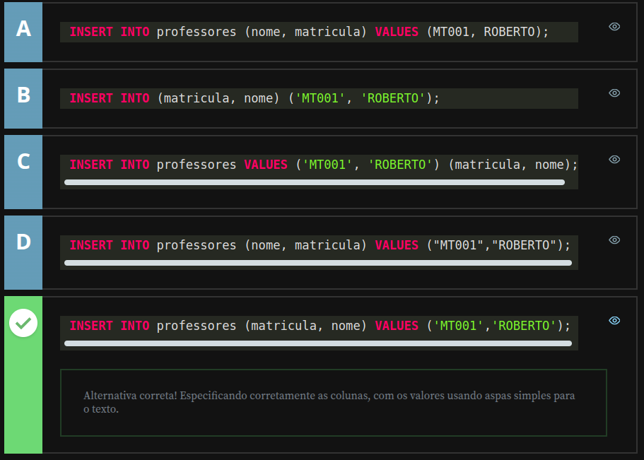
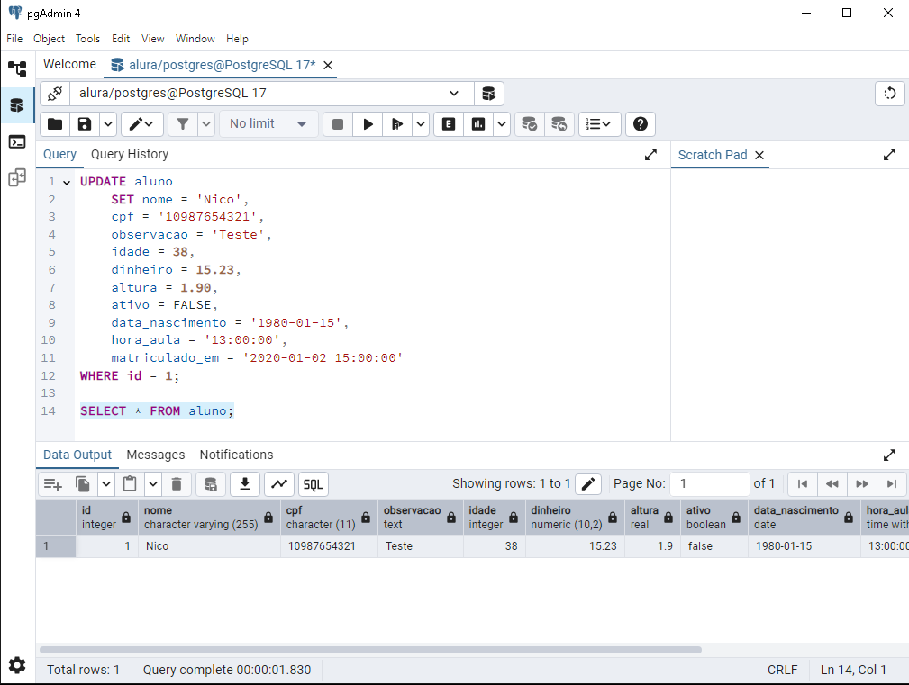
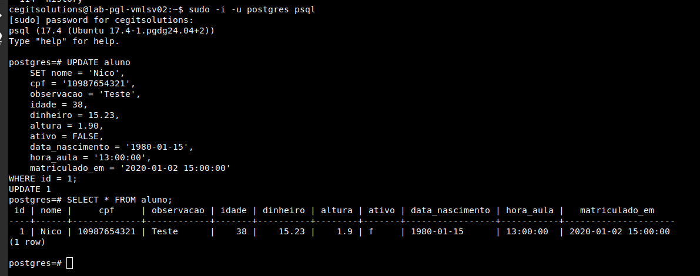
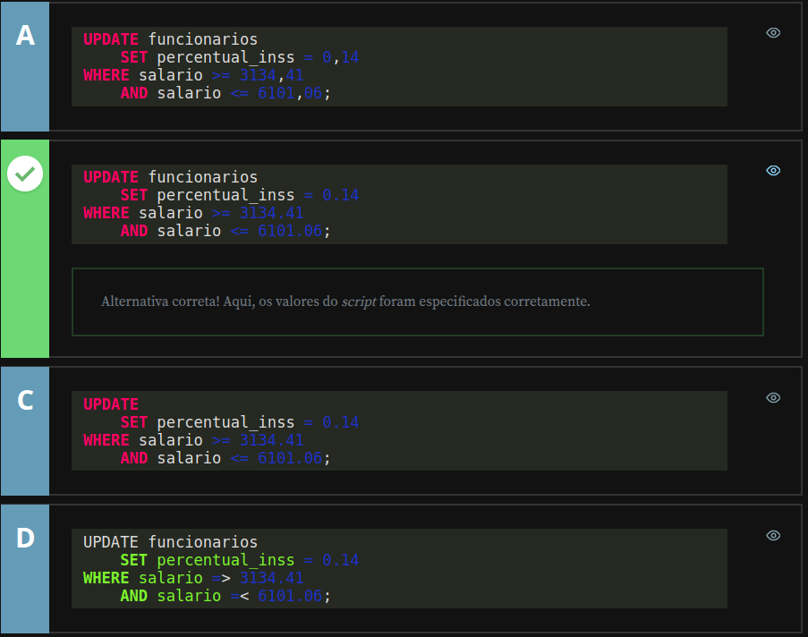
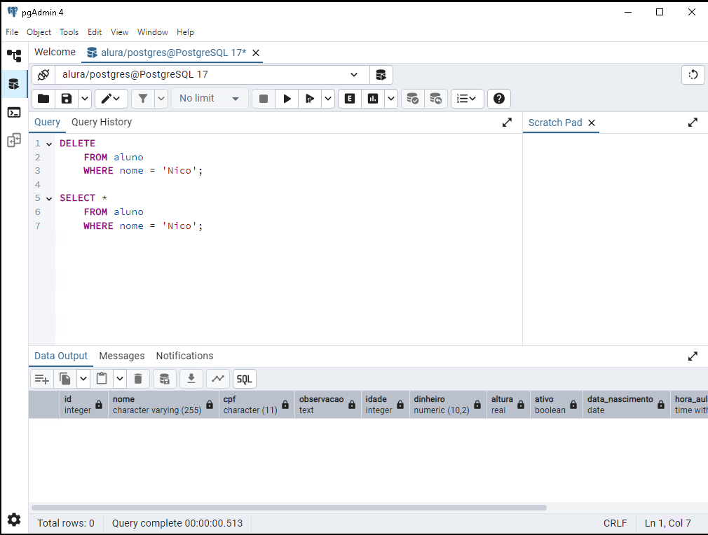
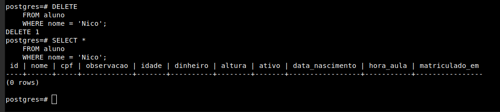
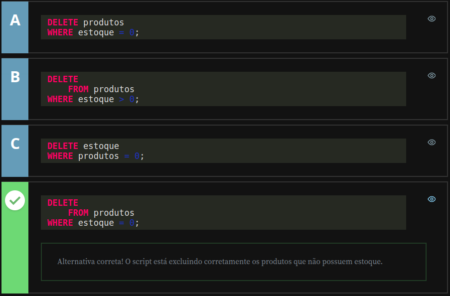

# Alura - PostgreSQL: Primeiros passos com SQL

## Executando operações CRUD

### Incluindo um registro na tabela

Agora que aprendemos a criar uma tabela no banco de dados e entendemos como funcionam os principais tipos de dados, é hora de aprender a incluir informações nessa tabela.

Começaremos com a sintaxe do comando `INSERT`. A tabela de exemplos do site oficial do PostgreSQL, acessível [aqui](https://www.postgresql.org/docs/current/sql-insert.html), contém detalhes sobre o uso desse comando. A sintaxe básica é a seguinte:

```sql
INSERT INTO table [ ( column [, ...] ) ]
    { DEFAULT VALUES | VALUES ( { expression | DEFAULT } [, ...] ) | query }
```

O comando começa com `INSERT INTO nome_da_tabela`, seguido pela declaração das colunas e valores. Os exemplos fornecidos ao final da página são bastante úteis para compreendermos o funcionamento.

No primeiro exemplo, vemos como incluir uma linha de dados declarando apenas os valores. Esse formato preenche todos os campos da tabela na sequência em que foram definidos:

```sql
INSERT INTO films VALUES
    ('UA502', 'Bananas', 105, '1971-07-13', 'Comedy', '82 minutes');
```

Porém, no dia-a-dia, utilizamos com mais frequência o modelo do segundo exemplo, onde especificamos as colunas a serem preenchidas:

```sql
INSERT INTO films (code, title, did, date_prod, kind)
    VALUES ('T_601', 'Yojimbo', 106, '1961-06-16', 'Drama');
```

Nesse formato, usamos `INSERT INTO nome_da_tabela`, declaramos as colunas, a string `VALUES` e seus respectivos valores. Vamos adotar esse modelo na aula.

### Exemplo prático: Incluindo registros na tabela `aluno`

A tabela `aluno` já foi criada, então o próximo passo é preencher seus campos. Começamos declarando o comando no pgAdmin:

```sql
INSERT INTO aluno();
```

Dentro dos parênteses, especificamos os campos a serem preenchidos. O campo `id` será incrementado automaticamente, então não precisa ser declarado. Iniciaremos com o campo `nome`, que aceita textos. Para incluir uma string, usamos aspas simples:

```sql
INSERT INTO aluno (
    nome
) VALUES (
    'Diogo'
);
```

Seguiremos com o campo `cpf`, que utiliza o tipo `CHAR(11)` e também requer uma string. Exemplo:

```sql
'12345678901'
```

O campo `observacao`, do tipo `TEXT`, pode armazenar textos maiores. Aqui utilizaremos um texto gerado pelo site [Lorem Ipsum](https://lipsum.com/), ajustado para uma única linha:

```sql
INSERT INTO aluno (
    nome,
    cpf,
    observacao
) VALUES (
    'Diogo',
    '12345678901',
    'Lorem ipsum dolor sit amet, consectetur adipiscing elit. Nulla ac dui et nisl vestibulum consequat. Integer vitae magna egestas, finibus libero dapibus, maximus magna. Fusce suscipit mi ut dui vestibulum, non vehicula felis fringilla.'
);
```

Agora, adicionaremos os campos restantes, incluindo:

- **idade (INTEGER)**: Para números inteiros, como `35`.
- **dinheiro (NUMERIC)**: Usamos o formato com ponto (`.`) para separação decimal, como `100.50`.
- **altura (REAL)**: Permite valores com ou sem casas decimais, como `1.81`.
- **ativo (BOOLEAN)**: Aceita `TRUE`, `FALSE` ou `NULL`, sendo `TRUE` para este exemplo.
- **data_nascimento (DATE)**: Usamos o formato `YYYY-MM-DD`, como `'1984-08-27'`.
- **hora_aula (TIME)**: Formatado como `HH24:MI:SS`, exemplo `'17:30:00'`.
- **matriculado_em (TIMESTAMP)**: Combina data e hora no formato `'YYYY-MM-DD HH24:MI:SS'`, exemplo `'2020-02-08 12:32:45'`.

### Finalizando os registros na tabela

Com todos os campos preenchidos, o comando final será:

```sql
INSERT INTO aluno (
    nome,
    cpf,
    observacao,
    idade,
    dinheiro,
    altura,
    ativo,
    data_nascimento,
    hora_aula,
    matriculado_em
) VALUES (
    'Diogo',
    '12345678901',
    'Lorem ipsum dolor sit amet, consectetur adipiscing elit. Nulla ac dui et nisl vestibulum consequat. Integer vitae magna egestas, finibus libero dapibus, maximus magna. Fusce suscipit mi ut dui vestibulum, non vehicula felis fringilla.',
    35,
    100.50,
    1.81,
    TRUE,
    '1984-08-27',
    '17:30:00',
    '2020-02-08 12:32:45'
);
```

Execute o código no pgAdmin e, em seguida, use o comando abaixo para verificar os dados incluídos na tabela:

```sql
SELECT * FROM aluno;
```

Saída esperada:


Retorno para execução via `pgsql`


Obs.: Neste caso o campo `text` foi suprimido para melhorar a visibilidade dos dados.

---

## Incluindo um professor - Testando conhecimento adquirido

O seu colega de trabalho conversou com a equipe de RH durante o levantamento de requisitos de um sistema escolar. Ele foi informado que precisa incluir um professor no cadastro do sistema via script, enquanto a tela de cadastro de professores não estava disponível.

A tabela de professores já estava criada e ele só precisa executar o script SQL de inclusão de um único professor. Apenas os campos matricula, com o valor MT001, e nome, com o valor ROBERTO, precisam ser preenchidos.

Marque o script que deve ser executado para incluir o professor no banco de dados.



---

### Atualizando um registro na tabela

Agora que aprendemos como registrar dados na tabela, vamos descobrir como alterá-los. A [documentação do PostgreSQL](https://www.postgresql.org/docs/current/sql-update.html) apresenta a sintaxe necessária para realizar um `UPDATE`.

```sql
UPDATE [ ONLY ] table_name [ * ] [ [ AS ] alias ]
    SET { column_name = { expression | DEFAULT } |
          ( column_name [, ...] ) = [ ROW ] ( { expression | DEFAULT } [, ...] ) |
          ( column_name [, ...] ) = ( sub-SELECT )
        }
                [ WHERE condition | WHERE CURRENT OF cursor_name ]
```

Além disso, há exemplos de uso. No primeiro exemplo, a tabela "films" passa por um `UPDATE` no campo `kind`, alterando o valor de "Drama" para "Dramatic".

### Aplicando o `UPDATE` no nosso banco de dados

Primeiramente, vamos selecionar os dados da tabela utilizando o `SELECT * FROM`. É fundamental usar o `WHERE` para filtrar os registros que serão atualizados, evitando alterações em todos os dados. No nosso caso, utilizaremos o campo `id` como filtro. Atualmente temos apenas uma entrada, mas ao trabalhar com várias, esse comando retornará apenas o registro específico.

```sql
SELECT *
    FROM aluno
WHERE id = 1;
```

Após filtrar os dados que desejamos alterar, utilizamos o comando `UPDATE nome_da_tabela` para realizar a atualização. Com o `SET`, especificamos os campos a serem modificados e os novos valores. No exemplo abaixo, alteramos o valor de todos os campos para fixar a sintaxe do `UPDATE`, similar à do `INSERT`. Copiaremos todos os campos e atribuímos novos valores:

```sql
UPDATE aluno
    SET nome = 'Nico',
        cpf = '10987654321',
        observacao = 'Teste',
        idade = 38,
        dinheiro = 15.23,
        altura = 1.90,
        ativo = FALSE,
        data_nascimento = '1980-01-15',
        hora_aula = '13:00:00',
        matriculado_em = '2020-01-02 15:00:00'
WHERE id = 1;
```

**Nota importante**: Certifique-se de usar o símbolo `=` ao atribuir novos valores.

Depois de executar o código `UPDATE`, você receberá uma mensagem confirmando a atualização bem-sucedida. Use o comando abaixo para verificar os novos dados na tabela:

```sql
SELECT * FROM aluno;
```

#### Saída esperada:

- Retorno no pgAdmin:



- Retorno ao executar via `pgsql`:



---

## Alterando o percentual do INSS - Testando conhecimento adquirido

Ocorreu uma mudança na lei trabalhista, informando que o valor do desconto do INSS sobre o salário dos funcionários deve ser alterado. Esse valor é baseado na faixa de percentual abaixo:

```text
até 1.045,00                    7,5%
de 1.045,01 até 2.089,60        9%
de 2.089,61 até 3.134,40        12%
de 3.134,41 até 6.101,06        14%
```

Baseado na tabela funcionarios, que possui o campo percentual_inss e o campo salario, marque a alternativa correta para a atualização do percentual_inss para 14%:



---

### Excluindo um registro da tabela

Agora que aprendemos a incluir e alterar registros no banco de dados, chegou o momento de explorar como excluir dados de uma tabela. A [documentação oficial do PostgreSQL](https://www.postgresql.org/docs/current/sql-delete.html) apresenta a sintaxe do comando `DELETE`.

```sql
DELETE FROM [ ONLY ] table_name [ * ] [ [ AS ] alias ]
    [ USING from_item [, ...] ]
    [ WHERE condition | WHERE CURRENT OF cursor_name ]
```

A documentação também apresenta dois exemplos práticos do comando `DELETE`. No primeiro, utilizamos `DELETE FROM nome_da_tabela` com um filtro `WHERE nome_da_coluna`, que identifica os registros com valores iguais ou diferentes ao especificado:

```sql
DELETE FROM films WHERE kind <> 'Musical';
```

No segundo exemplo, combinamos `DELETE` com uma subconsulta, permitindo excluir dados baseados no resultado filtrado de um `SELECT`:

```sql
DELETE FROM films
  WHERE producer_id IN (SELECT id FROM producers WHERE name = 'foo');
```

### Aplicando o `DELETE` na tabela `aluno`

Vamos aplicar esse comando ao nosso banco de dados, onde o registro do "Nico" está presente. Antes de excluir o dado, é fundamental utilizar o `SELECT` para verificar se o filtro está correto. Isso evita a exclusão inadvertida de registros. No exemplo abaixo, filtramos os registros com o nome `Nico`:

```sql
SELECT *
    FROM aluno 
    WHERE nome = 'Nico';
```

Se utilizarmos um nome diferente, não haverá nenhum retorno, pois atualmente só temos o registro de "Nico". Por isso, sempre que for excluir um dado, execute o `SELECT` antes para confirmar os resultados. Após validar o filtro, basta substituir o comando `SELECT *` por `DELETE` e executar a exclusão:

```sql
DELETE FROM aluno 
    WHERE nome = 'Nico';
```

Agora, ao usar novamente o comando `SELECT * FROM aluno` para buscar o registro de "Nico", não haverá retorno, pois ele foi removido da tabela. Note que, se omitirmos o filtro `WHERE` e executarmos apenas `DELETE FROM nome_da_tabela`, todos os registros da tabela serão apagados. Geralmente, o objetivo é excluir apenas um registro específico, por isso o uso do filtro é essencial.

#### Saída esperada:

- Retorno no pgAdmin:



- Retorno ao executar via `pgsql`:



Com isso, aprendemos como funciona o comando `DELETE` para exclusão de registros. Na próxima aula, aprofundaremos o uso de filtros.

---

## Excluindo produtos - Testando conhecimento adquirido

Você recebeu a tarefa de criar um script para remover os produtos que não possuíam mais estoque, na tabela produtos. Essa tabela possui um campo chamado estoque, que armazena a quantidade de itens disponíveis.

Marque a alternativa que representa o script de exclusão dos produtos sem estoque.



---

## Faça como eu fiz

Nesta etapa, o instrutor sugere que você siga todos os passos apresentados ao longo da aula. É essencial reproduzir as ações demonstradas nos vídeos para consolidar o aprendizado e avançar com segurança para a próxima etapa.

Este documento reflete minha aplicação prática dos conceitos aprendidos.

---

## Projeto da aula

Aqui são fornecidos os scripts utilizados pelo instrutor ao logo da aula:

- [Aula02-atividade01.sql](./src/Aula02-atividade01.sql)
- [Aula02-atividade03.sql](./src/Aula02-atividade03.sql)
- [Aula02-atividade05.sql](./src/Aula02-atividade05.sql)

---

## O que aprendemos

Nesta aula, aprendemos:

- Como incluir um registro na tabela, entendendo a sintaxe de inclusão de cada tipo de campo
- A efetuar uma consulta simples, para listar os dados da tabela
- Como alterar um registro na tabela
- Como excluir um registro na tabela

---

## Fim do Módulo

---
