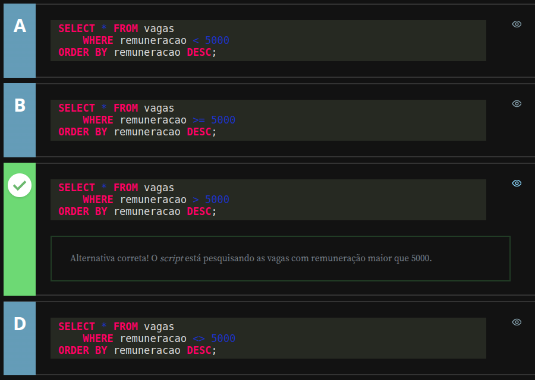
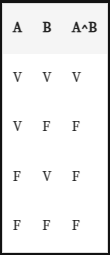
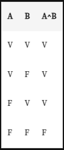
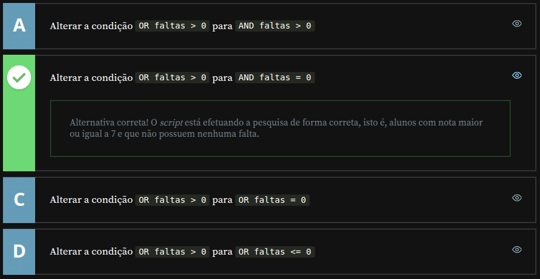

# Alura - PostgreSQL: Primeiros passos com SQL

## Consultas com Filtros

### Selecionando colunas específicas da tabela

Antes de aprendermos sobre os filtros, precisamos aprender outra coisa importante, que é a seleção de campos específicos do banco de dados.

Até o momento, nossas seleções incluíam todos os campos da tabela. Agora vamos descobrir como filtrar um campo e como atribuir um alias para ele.

Começaremos criando um registro no nosso banco de dados, porque na nossa última aula o deixamos vazio. Basta retornar no nosso código de INSERT e executá-lo novamente.

```sql
INSERT INTO aluno (
    nome,
    cpf,
    observacao,
    idade,
    dinheiro,
    altura,
    ativo,
    data_nascimento,
    hora_aula,
    matriculado_em
) VALUES (
    'Diogo',
    '12345678901',
    'Lorem ipsum dolor sit amet, consectetur adipiscing elit. Nulla ac dui et nisl vestibulum consequat. Integer vitae magna egestas, finibus libero dapibus, maximus magna. Fusce suscipit mi ut dui vestibulum, non vehicula felis fringilla. Vestibulum eget massa blandit, viverra quam non, convallis libero. Morbi ut nunc ligula. Duis tristique purus augue, nec sodales sem scelerisque dignissim. Sed vel rutrum mi. Nunc accumsan magna quis tempus rhoncus. Duis volutpat nulla a aliquet feugiat. Vestibulum rhoncus mi diam, eu consectetur sapien eleifend in. Donec sed facilisis velit. Duis tempus finibus venenatis. Mauris neque nisl, pulvinar eu volutpat eu, laoreet in massa. Quisque vestibulum eros ac tortor facilisis vulputate. Sed iaculis purus non sem tempus mollis. Curabitur felis lectus, aliquam id nunc ut, congue accumsan tellus.',
    35,
    100.50,
    1.81,
    TRUE,
    '1984-08-27',
    '17:30:00',
    '2020-02-08 12:32:45'
);
```

Usando o `SELECT * FROM aluno;` notamos que os nossos dados foram incluídos na tabela.

Para retornar apenas os dados da coluna "nome", executamos o comando `SELECT nome FROM aluno;`, e assim veremos só os registros de nome. Se quisermos os resultados de mais campos, como "nome", "idade" e "matriculado_em", informamos esses campos, separados por vírgula, após o `SELECT`.

```sql
SELECT nome,
       idade,
       matriculado_em
    FROM aluno;
```

A partir dessa seleção, podemos usar o comando `AS`, ou seja, **um alias**, para trocar o nome de exibição dos campos na tabela. Se escrevermos `SELECT matriculado_em AS quando_se_matriculou`, essa coluna aparecerá com o nome "quando_se_matriculou".

O alias também pode ser usado para atribuir nomes com espaço para os campos, o que pode ser útil, por exemplo, para elaborar um relatório. Nesses casos, os novos nomes precisam estar entre **aspas duplas " "**, ou o programa não irá reconhecê-los e aparecerá uma mensagem de erro de sintaxe.

```sql
SELECT nome AS "Nome do Aluno",
       idade,
       matriculado_em AS quando_se_matriculou
    FROM aluno;
```

Exemplo de retorno:


Obs.: No SQL Server para atribuirmos nomes com espaço para os campos, podemos tanto usar **aspas duplas " "**, como também **aspas simples ' '**.

---

## Relatório de pacientes - Testando conhecimento adquirido

A atendente de um hospital precisa gerar o relatório com nome completo e telefone dos pacientes. O sistema possui uma tabela pacientes, onde possui o campo nome e telefone.

Dentre as alternativas abaixo, selecione aquela que contém o script que representa a geração do relatório para a atendente.


---

### Filtrando registros de campos do tipo texto

Começaremos a trabalhar com filtros e, para isso, precisamos incluir mais dados na tabela, que até o momento só tem o usuário "Diogo".

Incluiremos apenas nomes, porque os filtros que aprenderemos podem ser usados com todos os campos do tipo texto, ou seja, VARCHAR, CHAR e TEXT.

Usaremos o comando INSERT INTO para incluir os novos nomes.

```sql
INSERT INTO aluno (nome) VALUES ('Vinícius Dias');
INSERT INTO aluno (nome) VALUES ('Nico Steppat');
INSERT INTO aluno (nome) VALUES ('João Roberto');
INSERT INTO aluno (nome) VALUES ('Diego');
```

Após executarmos esse script para incluirmos todos esses nomes no nosso registro, começaremos a conhecer os filtros, que funcionam a partir do WHERE nome_do_campo .

O primeiro filtro que aprenderemos é o "igual", representado pelo símbolo = e usado para pesquisar um texto específico.

```sql
SELECT *
    FROM aluno
 WHERE nome = 'Diogo';
```

Ao executar esse código, notamos que `WHERE nome = 'Diogo;`' retorna apenas os dados do "Diogo". Se pesquisássemos, por exemplo, `WHERE nome = 'Diogo Oliveira'` , não acharíamos nenhum resultado, pois o único "Diogo" na nossa tabela não tem sobrenome.

O próximo filtro é o "diferente", usado quando queremos todos os dados que não declaramos. Pode ser representado pelo sinal <> ou pelo sinal != . Então `WHERE nome <> 'Diogo' e WHERE nome != 'Diogo'` retornam o mesmo resultado, ou seja, todos os registros que não são o "Diogo".

Outra forma de filtrar uma informação é utilizando o `LIKE` que pode ser entendido como "parecido com". Dessa forma, `WHERE nome LIKE 'Diogo'` pode ser lido como "ONDE nome PARECIDO COM 'Diogo'". Ao utilizarmos o `LIKE` podemos aplicar dois operadores especiais: o `_` (underline) e o `%` (porcentagem).

Começaremos aprendendo o `_` , que significa "qualquer caractere naquela posição", ou seja, a posição que ele ocupa substitui um caractere. Então se pesquisarmos com `WHERE nome LIKE '_iogo'`, os nomes apresentados começarão por qualquer letra, mas terminarão com "iogo". Vejamos outro exemplo.

```sql
SELECT * 
    FROM aluno
 WHERE nome LIKE 'Di_go';
```

Nesse caso, o filtro ignora o terceiro caractere entre o "Di" e o "go", ou seja, a tabela retornará tanto o "Diego", quanto o "Diogo". Em resumo, o `_` , que pode estar no começo, meio ou final de uma palavra, **ocupa o espaço específico de um caractere**, que será ignorado na busca.

Outra forma de usarmos o `_` é com o comando `NOT LIKE`, ou seja, "não parece com". Portanto, em `WHERE nome NOT LIKE 'Di_go'` , a tabela apresentará apenas os registros de nomes que não tenham comecem com "Di" e terminem com "go", independentemente do caractere que estiver entre essas sílabas. No caso, todos os nomes que não sejam "Diego" ou "Diogo".

Agora aprenderemos o caractere `%` , que substitui todos os caracteres até o espaço que ele ocupa. Por exemplo, para recuperar todos os nomes que comecem com "D", usamos o comando:

```sql
SELECT * 
    FROM aluno
 WHERE nome LIKE 'D%';
```

Novamente aparecem os resultados do "Diogo" e do "Diego", que são os nomes da nossa tabela que começam dom D. Podemos filtrar também pela última letra ao invés da primeira. Por exemplo, para filtrar os nomes terminados em "s", utilizamos o comando `WHERE nome LIKE %s';` . Assim aparecerão os dados do "Vinícius Dias". Outra possibilidade é recuperar todos os nomes que tenham espaço:

```sql
SELECT * 
    FROM aluno
 WHERE nome LIKE '% %';
```

Esse filtro ignora quaisquer nomes que estejam antes ou depois do espaço, então os únicos dados que não vão aparecer serão do "Diogo" e do "Diego", porque todos os outros usuários têm nome e sobrenome divididos por espaço. O ``%` também pode ser usado entre textos, como `%i%a%`.

```sql
SELECT * 
    FROM aluno
 WHERE nome LIKE '%i%a%';
```

Esse comando apresenta os dados que tenham "i**", em alguma parte do texto, seguido por "a", em outra parte do texto. No nosso banco de dados retorna os nomes "Vinícius Dias", devido ao "i" em "Vinícius" e o "a" em "Dias", e o "Nico Steppat", devido ao "i" em "Nico" e o "a" em "Steppa**t".

Até agora aprendemos o filtro de igualdade, de diferença, os filtros com LIKE e NOT LIKE e os caracteres especiais `_` , que substitui um caractere qualquer naquela posição específica, e `%` que substitui múltiplos caracteres no começo, no final ou entre o texto.

Na próxima aula aprenderemos a filtrar os campos de números, data, hora e boleanos.

---

## Pesquisa no dicionário - Testando conhecimento adquirido

Você recebeu uma tarefa para desenvolver uma funcionalidade de um programa em que são listadas as palavras do dicionário que começam com a letra do alfabeto que o usuário clicar. O nome da tabela que armazena as palavras se chama dicionario e o campo que contem as palavras se chama palavra.

Dentre as alternativas abaixo, selecione aquela que representa a consulta que precisa ser executada quando o usuário clicou na letra F.


---

### Filtrando registros de campos do tipo numérico, data e booleano

Nesta aula, aprenderemos a aplicar filtros em campos do tipo numérico, data e booleano. Também veremos os comandos universais `IS` e `IS NOT`, que podem ser usados em qualquer tipo de campo, incluindo texto.

#### Filtros para campos nulos

Ao selecionar nossa tabela com o comando `SELECT * FROM aluno;`, notamos que apenas o CPF do "Diogo" está preenchido, enquanto os demais registros estão nulos. Para identificar esses valores, não podemos usar `WHERE cpf = NULL`, pois no PostgreSQL valores nulos não são comparados diretamente com o operador `=`. Nesse caso, usamos o comando `IS NULL`:

```sql
SELECT *
    FROM aluno
 WHERE cpf IS NULL;
```

Esse comando retorna todos os registros cujo campo CPF está nulo, ou seja, os dados do "Diogo" não aparecem. Para buscar os registros com CPF preenchido, utilizamos o comando oposto: `IS NOT NULL`:

```sql
SELECT *
    FROM aluno
 WHERE cpf IS NOT NULL;
```

Esse comando retorna apenas os registros cujo campo CPF não é nulo, como o do "Diogo".

---

#### Operadores de comparação

Agora veremos os filtros específicos para campos numéricos, datas e horários. Eles utilizam operadores como `=` (igual), `<>` ou `!=` (diferente), `>=` (maior ou igual), `<=` (menor ou igual), `>` (maior) e `<` (menor). Exemplos:

- **Igualdade:**  

  ```sql
  WHERE idade = 35;
  ```

  Retorna apenas os usuários cuja idade seja exatamente 35.

- **Diferença:**  

  ```sql
  WHERE idade <> 36;
  ```

  Retorna todos os registros cuja idade não seja 36.

> **Nota importante:** Com exceção dos comandos `IS` e `IS NOT`, os operadores de comparação não retornam registros cujo campo está nulo.

- **Maior ou igual/menor ou igual:**  

  ```sql
  WHERE idade >= 35;
  WHERE idade <= 50;
  ```

  Esses comandos retornam valores dentro do intervalo especificado.

- **Maior/menor:**  

  ```sql
  WHERE idade > 30;
  WHERE idade < 100;
  ```

  Esses filtros retornam os registros que superam ou não atingem o valor declarado.

- **Intervalos com `BETWEEN`:**  

  ```sql
  SELECT *
      FROM aluno
   WHERE idade BETWEEN 10 AND 35;
  ```

  O comando `BETWEEN` retorna todos os valores dentro do intervalo especificado, inclusive os extremos. No exemplo, tanto `10` quanto `35` estão incluídos nos resultados.

Todos esses filtros funcionam para campos dos tipos `INTEGER`, `REAL`, `SERIAL`, `NUMERIC`, `DATE`, `TIME` e `TIMESTAMP`.

---

#### Filtros para campos booleanos

Os campos booleanos utilizam apenas os filtros `=` e `<>`. Para buscar registros cujo campo seja verdadeiro (`TRUE`) ou falso (`FALSE`), usamos:

- **Valores `TRUE`:**  

  ```sql
  SELECT *
      FROM aluno
   WHERE ativo = true;
  ```

  Esse comando retorna registros onde o campo "ativo" é verdadeiro.

- **Valores `FALSE`:**  

  ```sql
  SELECT *
      FROM aluno
   WHERE ativo = false;
  ```

  Retorna os registros cujo campo "ativo" é falso.

Para filtrar registros onde o campo booleano é nulo, utilizamos o comando `IS`:

```sql
SELECT *
    FROM aluno
 WHERE ativo IS NULL;
```

Esse comando retorna os registros nos quais o campo "ativo" não possui valor.

---

Agora que conhecemos os filtros para diferentes tipos de campos, na próxima aula aprenderemos como usar os operadores lógicos `AND` e `OR` para combinar múltiplos filtros em uma única consulta.

---

## Vagas com remuneração alta - Testando conhecimento adquirido

Você está implementando um sistema de vagas de emprego e precisa implementar uma funcionalidade para pesquisar vagas com uma remuneração acima de um determinado valor. Essas vagas estão armazenadas na tabela vagas e possuem um campo chamado remuneracao.

Selecione a alternativa que representa o script que deve ser implementado para mostrar as vagas com remuneração acima de 5000.



---

### Filtrando utilizando operadores E e OU

Nesta aula, aprenderemos como combinar filtros utilizando os operadores AND (e) e OR (ou), permitindo criar consultas mais específicas e precisas. Começaremos pelo operador AND.

#### Operador AND

O operador AND funciona como uma soma de condições, exibindo apenas os registros que atendem a **todas** as exigências declaradas. Imagine a situação em que precisamos buscar os nomes que começam com a letra "D" e têm o CPF preenchido. A consulta seria:

```sql
SELECT *
    FROM aluno
 WHERE nome LIKE 'D%'
   AND cpf IS NOT NULL;
```

Se utilizarmos apenas `nome LIKE 'D%'`, o código retornará todos os registros cujo nome começa com "D". No entanto, ao combinarmos com `AND cpf IS NOT NULL`, a consulta retorna somente os registros que atendem às **duas condições**: começar com "D" e ter o CPF preenchido.

> **Dica de estudos**: Os comandos `LIKE`, `IS NOT` e o operador `%` foram ensinados na aula passada. Caso queira revisar o funcionamento deles, consulte a aula anterior.

---

#### Operador OR

O operador OR exibe os registros que atendem a pelo menos **uma** das condições impostas. Por exemplo, se quisermos buscar os usuários chamados "Diogo" ou "Rodrigo", utilizamos:

```sql
SELECT *
    FROM aluno
 WHERE nome LIKE 'Diogo'
    OR nome LIKE 'Rodrigo';
```

Mesmo que não haja nenhum registro de "Rodrigo" no banco, o comando retorna os dados do "Diogo". Se adicionarmos outra condição, como `OR nome LIKE 'Nico%'`, o resultado incluirá os dados de "Diogo" e todos os registros que começam com "Nico", como o "Nico Steppat".

> **Diferença principal**:  
> - **AND**: Retorna apenas os registros que atendem **todas** as condições.  
> - **OR**: Retorna os registros que atendem **pelo menos uma** das condições.

---

#### Exemplos Práticos

Veja este exemplo para fixar o funcionamento do AND:

```sql
SELECT *
    FROM aluno
 WHERE nome LIKE 'Diogo'
   AND nome LIKE 'Nico%';
```

Esse comando não apresenta nenhum resultado, pois as condições impostas devem ser atendidas pelo mesmo registro (na mesma linha). Não é possível que um nome seja exatamente "Diogo" e contenha "Nico" ao mesmo tempo. 

Agora, trocando uma condição para `LIKE '%Steppat'`, como:

```sql
SELECT *
    FROM aluno
 WHERE nome LIKE '%Steppat'
   AND nome LIKE 'Nico%';
```

O comando retorna o registro do "Nico Steppat", pois as condições (nome terminado em "Steppat" e começado com "Nico") são atendidas pelo mesmo registro.

Se quisermos buscar os registros de "Diogo" e dos usuários que começam com "Nico", utilizamos o operador OR:

```sql
SELECT *
    FROM aluno
 WHERE nome LIKE 'Diogo'
    OR nome LIKE 'Nico%';
```

Nesse caso, o resultado inclui os registros de "Diogo" e "Nico Steppat", pois cada condição é atendida individualmente.

---

#### Tabelas Verdade

As [tabelas verdade](https://pt.wikipedia.org/wiki/Tabela-verdade) ajudam a entender o funcionamento lógico dos operadores. Elas mostram como os filtros são interpretados pelo programa.

- **Tabela Verdade para o operador AND (conjunção):**  
  Para retornar um resultado, **todas as condições devem ser verdadeiras**.



- **Tabela Verdade para o operador OR (disjunção):**  
  Um resultado é exibido se pelo menos **uma condição for verdadeira**.



---

#### Exemplo de Filtro OR sem resultados

Quando utilizamos o operador OR para buscar registros que não existem, como no exemplo abaixo, a consulta não retorna nenhum dado:

```sql
SELECT *
    FROM aluno
 WHERE nome LIKE 'Thiago'
    OR nome LIKE 'Miguel';
```

Como não temos registros de "Thiago" e "Miguel", a busca retorna vazia.

---

Com o uso dos operadores AND e OR, conseguimos criar consultas avançadas, permitindo combinações de filtros e adaptando os resultados às nossas necessidades. Essas formas de combinar filtros são essenciais para tornar o trabalho com bancos de dados mais eficiente e flexível.

---

## Apuração de resultado - Testando conhecimento adquirido

Você está analisando a consulta SQL de um sistema escolar, para identificar o problema no resultado de um relatório, que deve trazer os alunos que tiveram a avaliação maior ou igual a 7 e não possuem nenhuma falta:

```sql
SELECT aluno
    FROM avaliacao 
WHERE nota_final >= 7 
    OR faltas > 0
```

Baseado na SQL acima, qual das alternativas descrevem a correção do script?



---

## Faça como eu fiz

Nesta etapa, o instrutor sugere que você siga todos os passos apresentados ao longo da aula. É essencial reproduzir as ações demonstradas nos vídeos para consolidar o aprendizado e avançar com segurança para a próxima etapa.

Este documento reflete minha aplicação prática dos conceitos aprendidos.

---

## Projeto da aula

Aqui são fornecidos os scripts utilizados pelo instrutor ao logo da aula:

- [Aula03-atividade01.sql](./src/Aula03-atividade01.sql)
- [Aula03-atividade03.sql](./src/Aula03-atividade03.sql)
- [Aula03-atividade05.sql](./src/Aula03-atividade05.sql)
- [Aula03-atividade07.sq](./src/Aula03-atividade07.sq)

---

## O que aprendemos

Nesta aula, aprendemos:

- A selecionar campos específicos da tabela
- Como definir um alias para os nomes dos campos
- A filtrar registros, utilizando o WHERE para campos do tipo de texto
  - Operadores `=`, `!=`,`<>`, `LIKE` e `NOT LIKE`
  - A diferença entre `=` e `LIKE`
  - O funcionamento do caractere `%` no filtro com `LIKE` e `NOT LIKE`
  - O funcionamento do caractere `_` no filtro com `LIKE` e `NOT LIKE`
- Como filtrar utilizando `IS NULL` e `IS NOT NULL`
- Como filtrar registros para campos do tipos relacionados a números, datas e horas
  - `=`, `!=`, `<>`, `<`, `<=`, `>`, `>=`
  - `BETWEEN`
- Como filtrar registros para campos do tipo booleano
  - `=`, `!=`, `<>`
- Como funciona os operadores lógicos `AND` e `OR`

---

## Fim do Módulo

---
