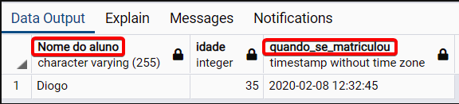
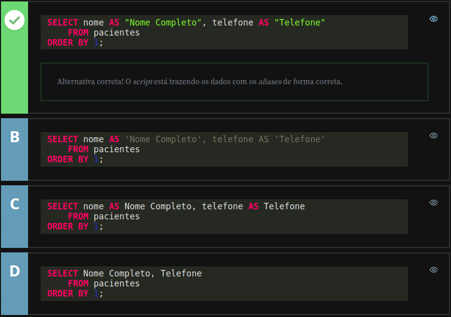
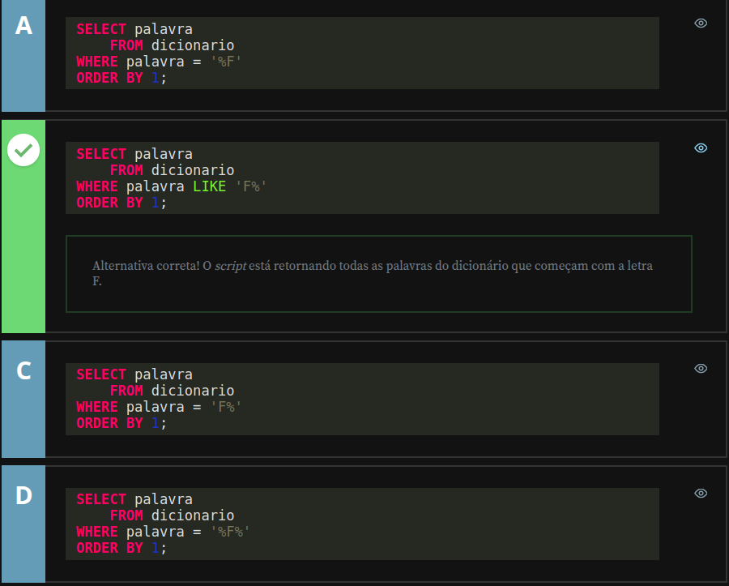

# Alura - PostgreSQL: Primeiros passos com SQL

## Consultas com Filtros

### Selecionando colunas específicas da tabela

Antes de aprendermos sobre os filtros, precisamos aprender outra coisa importante, que é a seleção de campos específicos do banco de dados.

Até o momento, nossas seleções incluíam todos os campos da tabela. Agora vamos descobrir como filtrar um campo e como atribuir um alias para ele.

Começaremos criando um registro no nosso banco de dados, porque na nossa última aula o deixamos vazio. Basta retornar no nosso código de INSERT e executá-lo novamente.

```sql
INSERT INTO aluno (
    nome,
    cpf,
    observacao,
    idade,
    dinheiro,
    altura,
    ativo,
    data_nascimento,
    hora_aula,
    matriculado_em
) VALUES (
    'Diogo',
    '12345678901',
    'Lorem ipsum dolor sit amet, consectetur adipiscing elit. Nulla ac dui et nisl vestibulum consequat. Integer vitae magna egestas, finibus libero dapibus, maximus magna. Fusce suscipit mi ut dui vestibulum, non vehicula felis fringilla. Vestibulum eget massa blandit, viverra quam non, convallis libero. Morbi ut nunc ligula. Duis tristique purus augue, nec sodales sem scelerisque dignissim. Sed vel rutrum mi. Nunc accumsan magna quis tempus rhoncus. Duis volutpat nulla a aliquet feugiat. Vestibulum rhoncus mi diam, eu consectetur sapien eleifend in. Donec sed facilisis velit. Duis tempus finibus venenatis. Mauris neque nisl, pulvinar eu volutpat eu, laoreet in massa. Quisque vestibulum eros ac tortor facilisis vulputate. Sed iaculis purus non sem tempus mollis. Curabitur felis lectus, aliquam id nunc ut, congue accumsan tellus.',
    35,
    100.50,
    1.81,
    TRUE,
    '1984-08-27',
    '17:30:00',
    '2020-02-08 12:32:45'
);
```

Usando o `SELECT * FROM aluno;` notamos que os nossos dados foram incluídos na tabela.

Para retornar apenas os dados da coluna "nome", executamos o comando `SELECT nome FROM aluno;`, e assim veremos só os registros de nome. Se quisermos os resultados de mais campos, como "nome", "idade" e "matriculado_em", informamos esses campos, separados por vírgula, após o `SELECT`.

```sql
SELECT nome,
       idade,
       matriculado_em
    FROM aluno;
```

A partir dessa seleção, podemos usar o comando `AS`, ou seja, **um alias**, para trocar o nome de exibição dos campos na tabela. Se escrevermos `SELECT matriculado_em AS quando_se_matriculou`, essa coluna aparecerá com o nome "quando_se_matriculou".

O alias também pode ser usado para atribuir nomes com espaço para os campos, o que pode ser útil, por exemplo, para elaborar um relatório. Nesses casos, os novos nomes precisam estar entre **aspas duplas " "**, ou o programa não irá reconhecê-los e aparecerá uma mensagem de erro de sintaxe.

```sql
SELECT nome AS "Nome do Aluno",
       idade,
       matriculado_em AS quando_se_matriculou
    FROM aluno;
```

Exemplo de retorno:



Obs.: No SQL Server para atribuirmos nomes com espaço para os campos, podemos tanto usar **aspas duplas " "**, como também **aspas simples ' '**.

---

## Relatório de pacientes - Testando conhecimento adquirido

A atendente de um hospital precisa gerar o relatório com nome completo e telefone dos pacientes. O sistema possui uma tabela pacientes, onde possui o campo nome e telefone.

Dentre as alternativas abaixo, selecione aquela que contém o script que representa a geração do relatório para a atendente.



---

### Filtrando registros de campos do tipo texto

Começaremos a trabalhar com filtros e, para isso, precisamos incluir mais dados na tabela, que até o momento só tem o usuário "Diogo".

Incluiremos apenas nomes, porque os filtros que aprenderemos podem ser usados com todos os campos do tipo texto, ou seja, VARCHAR, CHAR e TEXT.

Usaremos o comando INSERT INTO para incluir os novos nomes.

```sql
INSERT INTO aluno (nome) VALUES ('Vinícius Dias');
INSERT INTO aluno (nome) VALUES ('Nico Steppat');
INSERT INTO aluno (nome) VALUES ('João Roberto');
INSERT INTO aluno (nome) VALUES ('Diego');
```

Após executarmos esse script para incluirmos todos esses nomes no nosso registro, começaremos a conhecer os filtros, que funcionam a partir do WHERE nome_do_campo .

O primeiro filtro que aprenderemos é o "igual", representado pelo símbolo = e usado para pesquisar um texto específico.

```sql
SELECT *
    FROM aluno
 WHERE nome = 'Diogo';
```

Ao executar esse código, notamos que `WHERE nome = 'Diogo;`' retorna apenas os dados do "Diogo". Se pesquisássemos, por exemplo, `WHERE nome = 'Diogo Oliveira'` , não acharíamos nenhum resultado, pois o único "Diogo" na nossa tabela não tem sobrenome.

O próximo filtro é o "diferente", usado quando queremos todos os dados que não declaramos. Pode ser representado pelo sinal <> ou pelo sinal != . Então `WHERE nome <> 'Diogo' e WHERE nome != 'Diogo'` retornam o mesmo resultado, ou seja, todos os registros que não são o "Diogo".

Outra forma de filtrar uma informação é utilizando o `LIKE` que pode ser entendido como "parecido com". Dessa forma, `WHERE nome LIKE 'Diogo'` pode ser lido como "ONDE nome PARECIDO COM 'Diogo'". Ao utilizarmos o `LIKE` podemos aplicar dois operadores especiais: o `_` (underline) e o `%` (porcentagem).

Começaremos aprendendo o `_` , que significa "qualquer caractere naquela posição", ou seja, a posição que ele ocupa substitui um caractere. Então se pesquisarmos com `WHERE nome LIKE '_iogo'`, os nomes apresentados começarão por qualquer letra, mas terminarão com "iogo". Vejamos outro exemplo.

```sql
SELECT * 
    FROM aluno
 WHERE nome LIKE 'Di_go';
```

Nesse caso, o filtro ignora o terceiro caractere entre o "Di" e o "go", ou seja, a tabela retornará tanto o "Diego", quanto o "Diogo". Em resumo, o `_` , que pode estar no começo, meio ou final de uma palavra, **ocupa o espaço específico de um caractere**, que será ignorado na busca.

Outra forma de usarmos o `_` é com o comando `NOT LIKE`, ou seja, "não parece com". Portanto, em `WHERE nome NOT LIKE 'Di_go'` , a tabela apresentará apenas os registros de nomes que não tenham comecem com "Di" e terminem com "go", independentemente do caractere que estiver entre essas sílabas. No caso, todos os nomes que não sejam "Diego" ou "Diogo".

Agora aprenderemos o caractere `%` , que substitui todos os caracteres até o espaço que ele ocupa. Por exemplo, para recuperar todos os nomes que comecem com "D", usamos o comando:

```sql
SELECT * 
    FROM aluno
 WHERE nome LIKE 'D%';
```

Novamente aparecem os resultados do "Diogo" e do "Diego", que são os nomes da nossa tabela que começam dom D. Podemos filtrar também pela última letra ao invés da primeira. Por exemplo, para filtrar os nomes terminados em "s", utilizamos o comando `WHERE nome LIKE %s';` . Assim aparecerão os dados do "Vinícius Dias". Outra possibilidade é recuperar todos os nomes que tenham espaço:

```sql
SELECT * 
    FROM aluno
 WHERE nome LIKE '% %';
```

Esse filtro ignora quaisquer nomes que estejam antes ou depois do espaço, então os únicos dados que não vão aparecer serão do "Diogo" e do "Diego", porque todos os outros usuários têm nome e sobrenome divididos por espaço. O ``%` também pode ser usado entre textos, como `%i%a%`.

```sql
SELECT * 
    FROM aluno
 WHERE nome LIKE '%i%a%';
```

Esse comando apresenta os dados que tenham "i**", em alguma parte do texto, seguido por "a", em outra parte do texto. No nosso banco de dados retorna os nomes "Vinícius Dias", devido ao "i" em "Vinícius" e o "a" em "Dias", e o "Nico Steppat", devido ao "i" em "Nico" e o "a" em "Steppa**t".

Até agora aprendemos o filtro de igualdade, de diferença, os filtros com LIKE e NOT LIKE e os caracteres especiais `_` , que substitui um caractere qualquer naquela posição específica, e `%` que substitui múltiplos caracteres no começo, no final ou entre o texto.

Na próxima aula aprenderemos a filtrar os campos de números, data, hora e boleanos.

---

## Pesquisa no dicionário - Testando conhecimento adquirido

Você recebeu uma tarefa para desenvolver uma funcionalidade de um programa em que são listadas as palavras do dicionário que começam com a letra do alfabeto que o usuário clicar. O nome da tabela que armazena as palavras se chama dicionario e o campo que contem as palavras se chama palavra.

Dentre as alternativas abaixo, selecione aquela que representa a consulta que precisa ser executada quando o usuário clicou na letra F.



---
