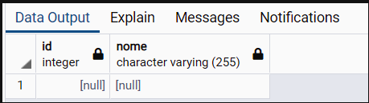
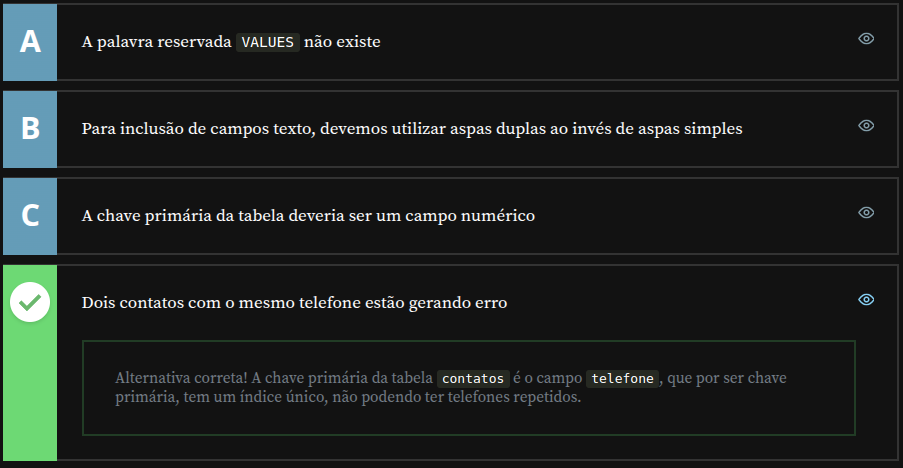
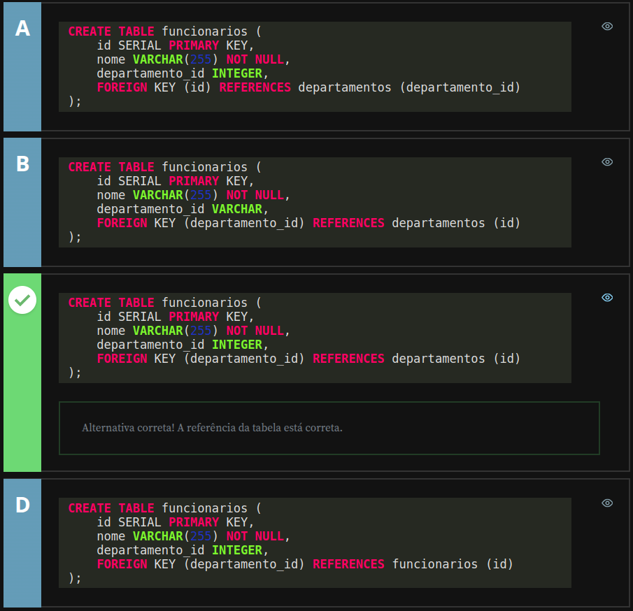
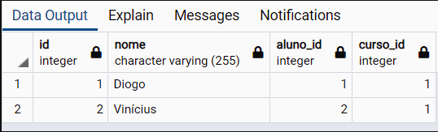
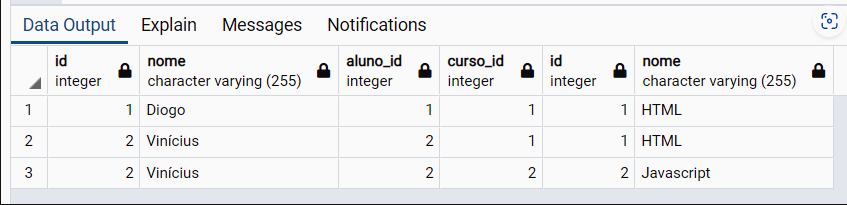
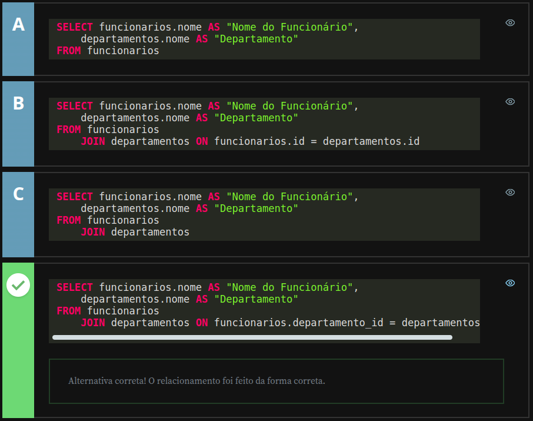

# Alura - PostgreSQL: Primeiros passos com SQL

## Trabalhando com Relacionamentos

### Criando tabela com chave primária

Nesta aula, aprenderemos sobre chaves primárias, um conceito essencial no gerenciamento de dados. A [documentação oficial do PostgreSQL](https://www.postgresql.org/docs/current/ddl-constraints.html) define a chave primária como "_uma coluna, ou grupo de colunas, que pode ser usada para identificar uma linha da tabela_". Vamos entender essa definição por meio de exemplos práticos.

#### Garantindo que os campos não sejam nulos

Vamos começar criando uma tabela simples chamada `curso`:

```sql
CREATE TABLE curso (
    id INTEGER,
    nome VARCHAR(255)
);
```

Embora seja possível inserir dados com o comando `INSERT INTO curso (...)`, essa tabela permite valores inválidos, como `NULL`. Por exemplo:

```sql
INSERT INTO curso (id, nome) VALUES (NULL, NULL);
```

Ao executar esse código, nosso banco de dados incluirá uma linha com campos vazios, como mostrado na imagem abaixo:



Para evitar essa situação, precisamos garantir que certos campos não aceitem valores nulos. Para isso, utilizamos o comando `NOT NULL` ao criar a tabela:

```sql
CREATE TABLE curso (
    id INTEGER NOT NULL,
    nome VARCHAR(255) NOT NULL
);
```

Se tentarmos executar o comando anterior (`INSERT INTO curso (id, nome) VALUES (NULL, NULL);`), receberemos uma mensagem de erro indicando que os valores nulos não são permitidos. Isso garante que os dados inseridos na tabela sejam válidos.

---

#### Definindo unicidade com UNIQUE

Agora que garantimos que os campos não podem ser nulos, precisamos evitar duplicidade nos valores da coluna `id`. Isso é especialmente importante para identificar cada registro de forma exclusiva. Utilizamos o comando `UNIQUE` para garantir essa propriedade:

```sql
CREATE TABLE curso (
    id INTEGER NOT NULL UNIQUE,
    nome VARCHAR(255) NOT NULL
);
```

Com essa tabela, tentamos inserir dois registros com o mesmo `id`:

```sql
INSERT INTO curso (id, nome) VALUES (1, 'HTML');
INSERT INTO curso (id, nome) VALUES (1, 'Javascript');
```

O segundo comando falha, pois o `id` precisa ser exclusivo. Ao alterar o `id` do curso de "Javascript" para `2`, conseguimos incluir ambos os registros com sucesso:

```sql
INSERT INTO curso (id, nome) VALUES (2, 'Javascript');
```

---

#### Utilizando PRIMARY KEY

A chave primária é uma forma mais intuitiva de declarar que uma coluna não pode ser nula e deve ser única. Podemos substituir `NOT NULL UNIQUE` pelo comando `PRIMARY KEY` para simplificar a definição:

```sql
CREATE TABLE curso (
    id INTEGER PRIMARY KEY,
    nome VARCHAR(255) NOT NULL
);
```

Com isso, o `id` assume automaticamente as propriedades de uma chave primária: não pode ser nulo e deve ser único. Qualquer tentativa de duplicar o valor do `id` resultará em erro:

```sql
INSERT INTO curso (id, nome) VALUES (1, 'HTML');
INSERT INTO curso (id, nome) VALUES (1, 'Javascript'); -- erro
```

Ao usar valores distintos, conseguimos inserir ambos os registros:

```sql
INSERT INTO curso (id, nome) VALUES (1, 'HTML');
INSERT INTO curso (id, nome) VALUES (2, 'Javascript');
```

---

#### Conclusão

Aprendemos que uma chave primária é uma coluna que possui duas propriedades fundamentais: não pode conter valores nulos e deve ser única. Isso garante a integridade dos dados e facilita o gerenciamento de registros em uma tabela.

Embora seja possível criar chaves primárias compostas (que utilizam mais de uma coluna), nesta aula focamos em chaves primárias simples, definidas em uma única coluna. Na próxima aula, aprofundaremos o uso de relacionamentos entre tabelas para entender como esses conceitos trabalham juntos.

---

## Erro de importação - Testando conhecimento adquirido

Você recebeu um script de banco de dados para importação de uma listagem de contatos:

```sql
CREATE TABLE contatos (
    telefone VARCHAR(15) PRIMARY KEY,
    nome VARCHAR(255) NOT NULL
);
```

Mas o script apresentou um erro, porque o script abaixo está dando erro no momento da importação:

```sql
INSERT INTO contatos (telefone, nome) VALUES ('(21) 98765-4321', 'João');
INSERT INTO contatos (telefone, nome) VALUES ('(21) 98765-4321', 'Roberto');
INSERT INTO contatos (telefone, nome) VALUES ('(21) 91234-5678', 'Maria');
```

Baseado na SQL acima, qual das alternativas descrevem a correção do script?



---

### Criando tabela com chave estrangeira

Nesta aula, exploraremos o funcionamento das chaves estrangeiras (FOREIGN KEY), que são fundamentais para estabelecer relações entre tabelas e garantir a consistência dos dados. Segundo a [documentação oficial do PostgreSQL](https://www.postgresql.org/docs/current/ddl-constraints.html), uma chave estrangeira é "_uma limitação que especifica que o valor de uma coluna (ou grupo de colunas) deve corresponder a uma linha em outra tabela_".

Atualmente, temos duas tabelas em nosso banco de dados: `curso` e `aluno`, que criamos anteriormente. Para simplificar, vamos recriar a tabela de alunos com novos registros.

---

#### Criando a tabela `aluno` e inserindo dados

Primeiro, apagamos a tabela existente com o comando:

```sql
DROP TABLE aluno;
```

Em seguida, criamos uma nova tabela `aluno`:

```sql
CREATE TABLE aluno (
    id SERIAL PRIMARY KEY,
    nome VARCHAR(255) NOT NULL
);
```

Agora, adicionamos dois registros para os alunos:

```sql
INSERT INTO aluno (nome) VALUES ('Diogo');
INSERT INTO aluno (nome) VALUES ('Vinícius');
```

Ao executar o comando `SELECT * FROM aluno;`, vemos que os nomes foram inseridos com sucesso.

---

#### Criando a tabela de relacionamento `aluno_curso`

Agora, queremos criar uma relação entre os alunos e os cursos. Para isso, criaremos uma nova tabela chamada `aluno_curso`:

```sql
CREATE TABLE aluno_curso (
    aluno_id INTEGER,
    curso_id INTEGER,
    PRIMARY KEY (aluno_id, curso_id)
);
```

Essa tabela será usada para registrar quais alunos estão matriculados em quais cursos. No entanto, precisamos garantir que os valores inseridos em `aluno_id` e `curso_id` correspondam a registros válidos nas tabelas `aluno` e `curso`. É aqui que entra o uso das chaves estrangeiras.

---

#### Definindo chaves estrangeiras

As chaves estrangeiras são declaradas com o comando `FOREIGN KEY`. Primeiro, definimos a chave estrangeira para a coluna `aluno_id`, informando que ela deve referenciar o campo `id` na tabela `aluno`:

```sql
FOREIGN KEY (aluno_id)
REFERENCES aluno (id)
```

Fazemos o mesmo para a coluna `curso_id`, vinculando-a ao campo `id` na tabela `curso`:

```sql
FOREIGN KEY (curso_id)
REFERENCES curso (id)
```

Com isso, recriamos a tabela `aluno_curso`, agora com as chaves estrangeiras:

```sql
DROP TABLE aluno_curso;

CREATE TABLE aluno_curso (
    aluno_id INTEGER,
    curso_id INTEGER,
    PRIMARY KEY (aluno_id, curso_id),

    FOREIGN KEY (aluno_id)
        REFERENCES aluno (id),

    FOREIGN KEY (curso_id)
        REFERENCES curso (id)
);
```

---

#### Validando registros com FOREIGN KEY

Agora, podemos inserir registros na tabela `aluno_curso` para matricular alunos nos cursos:

```sql
INSERT INTO aluno_curso (aluno_id, curso_id) VALUES (1,1);
INSERT INTO aluno_curso (aluno_id, curso_id) VALUES (2,1);
INSERT INTO aluno_curso (aluno_id, curso_id) VALUES (3,1); -- erro
```

Neste exemplo:

1. Os registros `(1,1)` e `(2,1)` são adicionados com sucesso, pois o aluno `1` (Diogo) e o aluno `2` (Vinícius) existem na tabela `aluno`, e o curso `1` (HTML) existe na tabela `curso`.

2. O registro `(3,1)` falha, pois não há um aluno com `id = 3` na tabela `aluno`. Do mesmo modo, se tentarmos adicionar `(1,3)`:

```sql
INSERT INTO aluno_curso (aluno_id, curso_id) VALUES (1,3); -- erro
```

Esse comando também resultará em erro, pois não existe um curso com `id = 3` na tabela `curso`.

Esses erros mostram que as chaves estrangeiras bloqueiam a inserção de registros inválidos, ajudando a evitar inconsistências nos dados.

---

#### Conclusão

Com as chaves estrangeiras, garantimos que os valores inseridos em uma tabela de relacionamento correspondam a registros válidos em outras tabelas. Isso é essencial para manter a integridade referencial no banco de dados.

Na próxima aula, aprenderemos a explorar esses relacionamentos por meio de comandos como `JOIN`, permitindo consultar dados vinculados de várias tabelas ao mesmo tempo.

---

## Departamento do funcionário - Testando conhecimento adquirido

Você está reestruturando um cadastro de funcionários e seus departamentos. Antes, a pessoa que incluía os funcionários no sistema podia digitar qualquer nome de departamento, então você resolve criar um cadastro de departamentos e vincular o cadastro do funcionário aos departamentos previamente cadastrados no sistema.

Visto que você já criou a tabela departamentos, com os campos id e nome:

```sql
CREATE TABLE departamentos (
    id SERIAL PRIMARY KEY,
    nome VARCHAR(255) NOT NULL
);
```

Como a tabela de funcionários deve ser estruturada?



---

### Consultas com Relacionamentos

Nesta aula, aprenderemos como combinar dados de diferentes tabelas em uma única consulta usando o comando `JOIN`. Esse recurso é essencial para visualizar informações relacionadas de maneira organizada e eficiente.

Atualmente, temos três tabelas em nosso banco de dados: `aluno`, `curso` e `aluno_curso`. Começaremos verificando os dados inseridos em cada uma delas:

```sql
SELECT * FROM aluno;
SELECT * FROM curso;
SELECT * FROM aluno_curso;
```

Essas consultas mostram que temos dois alunos registrados na tabela `aluno`, dois cursos na tabela `curso` e as informações de matrículas na tabela `aluno_curso`.

#### O problema de consultas separadas

Até agora, para verificar em quais cursos um aluno está matriculado, precisaríamos consultar os IDs individualmente em cada tabela. Por exemplo:

```sql
SELECT * FROM aluno WHERE id = 1;
SELECT * FROM curso WHERE id = 1;
```

Essa abordagem é pouco prática e difícil de interpretar. Para resolver isso, utilizaremos o comando `JOIN`, que combina os dados de diferentes tabelas em uma única consulta.

---

#### Utilizando o comando JOIN

O comando `JOIN` é usado para unir os dados de duas tabelas baseando-se em uma condição que define a relação entre elas. Por exemplo, para combinar os dados das tabelas `aluno` e `aluno_curso`, usamos:

```sql
SELECT *
  FROM aluno
  JOIN aluno_curso ON aluno_curso.aluno_id = aluno.id;
```

Essa consulta une as tabelas `aluno` e `aluno_curso`, com base na relação entre `aluno.id` e `aluno_curso.aluno_id`. O resultado mostra, em uma única tabela, os dados de ambos os registros:



Para adicionar as informações da tabela `curso`, complementamos o código com mais um `JOIN`:

```sql
SELECT *
  FROM aluno
  JOIN aluno_curso ON aluno_curso.aluno_id = aluno.id
  JOIN curso ON curso.id = aluno_curso.curso_id;
```

Agora, a consulta combina as três tabelas, retornando dados mais detalhados. Por exemplo, podemos ver que o aluno "Diogo" está matriculado no curso de "HTML" (linha 1) e o aluno "Vinícius" também está matriculado no mesmo curso (linha 2).

---

#### Inserindo novos registros e atualizando a busca

Vamos matricular o aluno "Vinícius" no curso de "Javascript":

```sql
INSERT INTO aluno_curso (aluno_id, curso_id) VALUES (2,2);
```

Ao executar a consulta anterior novamente, agora vemos que o aluno "Vinícius" aparece matriculado em dois cursos: "HTML" e "Javascript".



---

#### Usando alias para organizar os resultados

Podemos organizar melhor os resultados usando `alias`, que nos permite renomear as colunas exibidas. Isso é útil, pois tanto a tabela `aluno` quanto a tabela `curso` possuem uma coluna chamada `nome`, o que pode causar confusão.

```sql
SELECT aluno.nome AS aluno,
       curso.nome AS curso
  FROM aluno
  JOIN aluno_curso ON aluno_curso.aluno_id = aluno.id
  JOIN curso ON curso.id = aluno_curso.curso_id;
```

Executando esse comando, os resultados especificam claramente qual nome pertence ao aluno e qual pertence ao curso.

Se quisermos personalizar ainda mais os nomes das colunas, podemos usar aspas para criar títulos mais descritivos:

```sql
SELECT aluno.nome AS "Nome do Aluno",
       curso.nome AS "Nome do Curso"
  FROM aluno
  JOIN aluno_curso ON aluno_curso.aluno_id = aluno.id
  JOIN curso ON curso.id = aluno_curso.curso_id;
```

O resultado exibe uma tabela limpa e organizada, ideal para relatórios.

---

#### Conclusão

Com o uso do comando `JOIN`, aprendemos a combinar dados de diferentes tabelas em uma única consulta, criando uma visão mais clara e detalhada das informações relacionadas. Além disso, exploramos a utilização de `alias` para organizar os resultados e tornar a leitura mais intuitiva.

Esse método é indispensável quando trabalhamos com bancos de dados que possuem relações entre tabelas, permitindo construir relatórios complexos e responder a perguntas que envolvem múltiplas fontes de dados. Na próxima aula, aprofundaremos o conhecimento explorando outros tipos de junções, como `LEFT JOIN` e `RIGHT JOIN`, que oferecem ainda mais flexibilidade para lidar com relações específicas.

---

## Funcionários com departamento - Testando conhecimento adquirido

A gerente do RH te pediu um relatório com o nome de todos os funcionários e o nome dos seus respectivos departamentos. As tabelas seguem a seguinte estrutura:

```sql
CREATE TABLE departamentos (
    id SERIAL PRIMARY KEY,
    nome VARCHAR(255) NOT NULL
);
```

```sql
CREATE TABLE funcionarios (
    id SERIAL PRIMARY KEY,
    nome VARCHAR(255) NOT NULL,
    departamento_id INTEGER,
    FOREIGN KEY (departamento_id) REFERENCES departamentos (id)
);
```

Selecione o script que retornaria os dados do relatório.



---

### LEFT, RIGHT, CROSS e FULL JOINS

Nesta aula, exploraremos diferentes tipos de `JOIN` para lidar com situações em que registros de uma tabela podem não ter correspondência em outra. Isso garantirá que nossa consulta retorne todos os dados relevantes, mesmo quando há informações ausentes.

#### O problema do JOIN padrão

Até agora, utilizamos `JOIN` para relacionar alunos e cursos. No entanto, esse comando retorna apenas os alunos matriculados em cursos existentes. Para entender melhor esse problema, adicionaremos um novo aluno que ainda não está matriculado:

```sql
INSERT INTO aluno (nome) VALUES ('Nico');
```

Agora, ao executar uma consulta padrão `JOIN` que retorna alunos e cursos, perceberemos que o aluno "Nico" não aparece nos resultados:

```sql
SELECT aluno.nome AS "Nome do Aluno",
       curso.nome AS "Nome do Curso"
  FROM aluno
  JOIN aluno_curso ON aluno_curso.aluno_id = aluno.id
  JOIN curso ON curso.id = aluno_curso.curso_id;
```

O mesmo ocorre quando adicionamos um novo curso:

```sql
INSERT INTO curso (id, nome) VALUES (3, 'CSS');
```

O curso "CSS" aparece na tabela `curso`, mas não na consulta acima. Isso ocorre porque um `JOIN` padrão só retorna registros que possuem correspondências em ambas as tabelas.

---

### **LEFT JOIN - Retornando todos os alunos**

Para garantir que todos os alunos apareçam, independentemente de estarem matriculados ou não, utilizamos `LEFT JOIN`. Esse comando prioriza os registros da tabela à esquerda (`aluno`) e preenche os campos sem correspondência com `NULL`:

```sql
SELECT aluno.nome AS "Nome do Aluno",
       curso.nome AS "Nome do Curso"
  FROM aluno
  LEFT JOIN aluno_curso ON aluno_curso.aluno_id = aluno.id
  LEFT JOIN curso ON curso.id = aluno_curso.curso_id;
```

Agora, nosso resultado incluirá todos os alunos, mesmo aqueles que não estão matriculados. Quando um aluno não tem um curso correspondente, o campo "Nome do Curso" aparecerá como `NULL`.

---

### **RIGHT JOIN - Retornando todos os cursos**

Agora consideremos a situação inversa: queremos listar todos os cursos, mesmo aqueles que não têm alunos matriculados. Para isso, utilizamos `RIGHT JOIN`, que prioriza os registros da tabela à direita (`curso`):

```sql
SELECT aluno.nome AS "Nome do Aluno",
       curso.nome AS "Nome do Curso"
  FROM aluno
  RIGHT JOIN aluno_curso ON aluno_curso.aluno_id = aluno.id
  RIGHT JOIN curso ON curso.id = aluno_curso.curso_id;
```

Os cursos sem alunos terão o campo "Nome do Aluno" preenchido com `NULL`.

---

### **FULL JOIN - Retornando todos os registros**

Para garantir que todos os alunos e todos os cursos sejam exibidos, independentemente de estarem relacionados ou não, utilizamos `FULL JOIN`:

```sql
SELECT aluno.nome AS "Nome do Aluno",
       curso.nome AS "Nome do Curso"
  FROM aluno
  FULL JOIN aluno_curso ON aluno_curso.aluno_id = aluno.id
  FULL JOIN curso ON curso.id = aluno_curso.curso_id;
```

Esse comando retorna **todos** os alunos e **todos** os cursos, preenchendo os campos sem correspondência com `NULL`. Dessa forma, conseguimos visualizar todas as informações disponíveis, inclusive o aluno "Nico" e o curso "CSS".

---

### **CROSS JOIN - Criando todas as combinações possíveis**

Existe outro tipo de junção que relaciona **todos** os registros da tabela "A" com **todos** os registros da tabela "B". Esse método é conhecido como `CROSS JOIN`. Aqui, cada aluno é vinculado a todos os cursos, independentemente de matrícula real:

```sql
SELECT aluno.nome AS "Nome do Aluno",
       curso.nome AS "Nome do Curso"
  FROM aluno
  CROSS JOIN curso;
```

O `CROSS JOIN` não exige um campo de ligação entre as tabelas. Ele simplesmente combina todas as linhas da tabela `aluno` com todas as linhas da tabela `curso`. O resultado é um conjunto expandido onde **cada aluno aparece vinculado a cada curso**.


Para observar o efeito do `CROSS JOIN`, adicionaremos mais um aluno:

```sql
INSERT INTO aluno (nome) VALUES ('João');
```

Agora, ao executar a mesma consulta, veremos que o aluno "João" está listado em todos os cursos disponíveis.

```sql
SELECT aluno.nome AS "Nome do Aluno",
       curso.nome AS "Nome do Curso"
  FROM aluno
  CROSS JOIN curso;
```

O resultado mostra que todos os alunos foram vinculados a todos os cursos:


---

### **Conclusão**

Aprendemos diferentes tipos de `JOIN` que permitem realizar consultas mais flexíveis e abrangentes:

- **LEFT JOIN** → Prioriza os registros da tabela à esquerda e exibe todos os alunos, mesmo os que não estão matriculados.
- **RIGHT JOIN** → Prioriza os registros da tabela à direita e exibe todos os cursos, mesmo os que não têm alunos matriculados.
- **FULL JOIN** → Exibe todos os registros de ambas as tabelas, preenchendo campos não correspondentes com `NULL`.
- **CROSS JOIN** → Combina todas as linhas da tabela `A` com todas as linhas da tabela `B`, gerando combinações amplas.

Com essas técnicas, conseguimos estruturar consultas mais eficientes e garantir que informações importantes não sejam omitidas. Na próxima aula, aprenderemos mais sobre restrições de relacionamento e como elas impactam a integridade dos dados.

---

## Faça como eu fiz

Nesta etapa, o instrutor sugere que você siga todos os passos apresentados ao longo da aula. É essencial reproduzir as ações demonstradas nos vídeos para consolidar o aprendizado e avançar com segurança para a próxima etapa.

Este documento reflete minha aplicação prática dos conceitos aprendidos.

---

## Projeto da aula

Aqui são fornecidos os scripts utilizados pelo instrutor ao logo da aula:

- [Aula04-atividade01](./src/Aula04-atividade01.sql)
- [Aula04-atividade03.sql](./src/Aula04-atividade03.sql)
- [Aula04-atividade05.sql](./src/Aula04-atividade05.sql)
- [Aula04-atividade07.sq](./src/Aula04-atividade07.sq)

---

## O que aprendemos

Nesta aula, aprendemos:

- Como funciona a chave primária
- Como funciona os campos que aceitam NULL e que não aceitam NULL (NOT NULL)
- Como funciona um campo UNIQUE
- Como criar uma chave primária
- Como funciona a chave estrangeira
- Como criar uma chave estrangeira
- Como criar consultas com relacionamentos
  - INNER JOIN
  - LEFT JOIN
  - RIGHT JOIN
  - FULL JOIN
  - CROSS JOIN

---

## Fim do Módulo

---