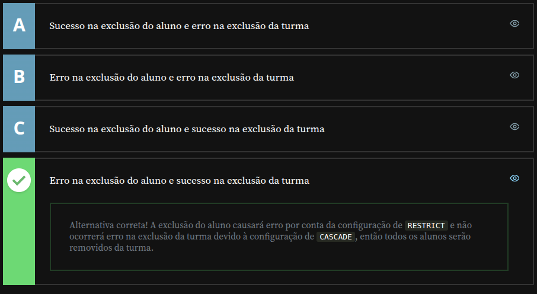

# Alura - PostgreSQL: Primeiros passos com SQL

## Usando CASCADE

### DELETE CASCADE

Nesta aula, exploraremos as restrições de chaves estrangeiras e como `ON DELETE CASCADE` pode garantir que registros relacionados sejam excluídos automaticamente, evitando erros ao deletar dados. Para entender sua aplicação, primeiro verificamos o estado atual do banco de dados:

```sql
SELECT * FROM aluno;
SELECT * FROM aluno_curso;
SELECT * FROM curso;
```

Temos quatro alunos na tabela `aluno`, três cursos na tabela `curso` e quatro matrículas registradas na tabela `aluno_curso`. Como não definimos restrições específicas, ao tentar excluir um aluno diretamente, recebemos um erro:

```sql
DELETE FROM aluno WHERE id = 1; -- erro!
```

Isso acontece porque esse aluno está vinculado à tabela `aluno_curso`, e a restrição padrão `ON DELETE RESTRICT` impede a exclusão de dados que possuem relações em outras tabelas. Para resolver esse problema, utilizaremos `ON DELETE CASCADE`, que garante que, ao excluir um registro principal (`aluno`), todos os seus registros relacionados em `aluno_curso` sejam apagados automaticamente.

---

### **Modificando a chave estrangeira com ON DELETE CASCADE**

Vamos recriar a tabela `aluno_curso` com essa funcionalidade. Primeiro, apagamos a versão existente:

```sql
DROP TABLE aluno_curso;
```

Agora, criamos a nova estrutura incluindo `ON DELETE CASCADE` na chave estrangeira que faz referência à tabela `aluno`:

```sql
CREATE TABLE aluno_curso (
    aluno_id INTEGER,
    curso_id INTEGER,
    PRIMARY KEY (aluno_id, curso_id),

    FOREIGN KEY (aluno_id)
        REFERENCES aluno (id)
        ON DELETE CASCADE,

    FOREIGN KEY (curso_id)
        REFERENCES curso (id)
);
```

---

### **Testando DELETE CASCADE**

Agora, registramos novas matrículas para testar a funcionalidade:

```sql
INSERT INTO aluno_curso (aluno_id, curso_id) VALUES (1,1);
INSERT INTO aluno_curso (aluno_id, curso_id) VALUES (2,1);
INSERT INTO aluno_curso (aluno_id, curso_id) VALUES (3,1);
INSERT INTO aluno_curso (aluno_id, curso_id) VALUES (1,3);
```

Podemos verificar as matrículas com a consulta `JOIN`:

```sql
SELECT aluno.nome AS "Nome do Aluno",
       curso.nome AS "Nome do Curso"
  FROM aluno
  JOIN aluno_curso ON aluno_curso.aluno_id = aluno.id
  JOIN curso ON curso.id = aluno_curso.curso_id;
```

Agora, excluímos o aluno `id = 1`:

```sql
DELETE FROM aluno WHERE id = 1;
```

Desta vez, ao invés de um erro, recebemos uma mensagem de sucesso. Para confirmar que a exclusão ocorreu corretamente, verificamos novamente as tabelas:

```sql
SELECT * FROM aluno; -- O aluno "Diogo" foi excluído
SELECT * FROM aluno_curso; -- Suas matrículas também foram removidas
```

Todos os registros relacionados ao aluno `id = 1` foram apagados automaticamente.

---

### **Conclusão**

Nesta aula, vimos como `ON DELETE CASCADE` facilita a manutenção do banco de dados, garantindo que, ao excluir um registro principal, seus dados relacionados também sejam removidos. Isso evita inconsistências e permite um gerenciamento mais eficiente.

Na próxima aula, aprenderemos como aplicar esse mesmo conceito com **UPDATE CASCADE**, garantindo que alterações feitas em registros principais sejam propagadas para tabelas relacionadas.

---

Exclusão de aluno e turma - Testando conhecimento adquirido

Você está trabalhando em um projeto de escola, em que existe um cadastro de turmas e os alunos são matriculados nelas. O relacionamento da tabela alunos_turma com alunos está configurado como RESTRICT, já o relacionamento com a tabela de turmas está configurado como CASCADE.

Qual comportamento será respeitado ao tentar excluir um aluno que esteja matriculado em uma turma e qual será o comportamento ao tentar excluir uma turma que possui aluno matriculado?



---

### UPDATE CASCADE
