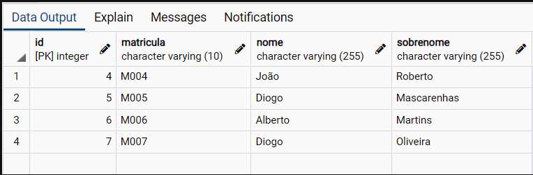
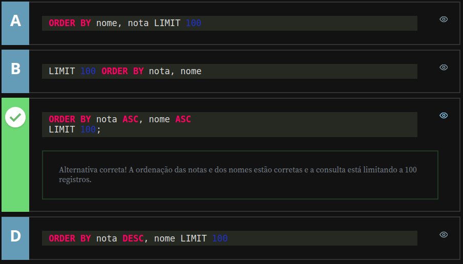
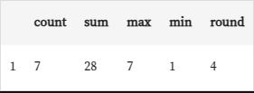
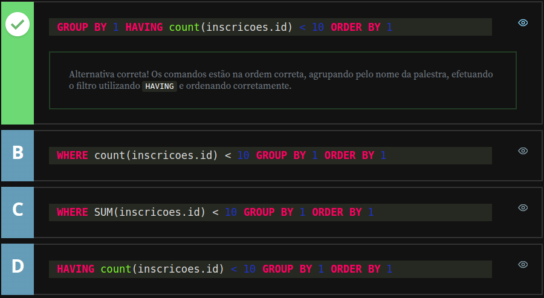

# Alura - PostgreSQL: Primeiros Passos com SQL

## Avançando com Consultas

### Ordenando as consultas

Nesta aula, aprenderemos como organizar consultas SQL utilizando `ORDER BY`. Essa cláusula é essencial para tornar a apresentação dos resultados mais clara, especialmente em tabelas grandes. Para isso, criaremos uma tabela simulando o cadastro de funcionários:

```sql
CREATE TABLE funcionarios(
    id SERIAL PRIMARY KEY,
    matricula VARCHAR(10),
    nome VARCHAR(255),
    sobrenome VARCHAR(255)
);
```

Agora, inserimos alguns registros:

```sql
INSERT INTO funcionarios (matricula, nome, sobrenome) VALUES ('M001', 'Diogo', 'Mascarenhas');
INSERT INTO funcionarios (matricula, nome, sobrenome) VALUES ('M002', 'Vinícius', 'Dias');
INSERT INTO funcionarios (matricula, nome, sobrenome) VALUES ('M003', 'Nico', 'Steppat');
INSERT INTO funcionarios (matricula, nome, sobrenome) VALUES ('M004', 'João', 'Roberto');
INSERT INTO funcionarios (matricula, nome, sobrenome) VALUES ('M005', 'Diogo', 'Mascarenhas');
INSERT INTO funcionarios (matricula, nome, sobrenome) VALUES ('M006', 'Alberto', 'Martins');
```

Executando `SELECT * FROM funcionarios;`, confirmamos que os registros foram incluídos corretamente.

---

### **Usando `ORDER BY` para ordenar os resultados**

O comando `ORDER BY` nos permite definir a ordem em que os resultados serão exibidos. Por padrão, a ordenação ocorre em ordem crescente:

```sql
SELECT * 
  FROM funcionarios
  ORDER BY nome;
```

Caso queiramos ordenar os resultados em ordem decrescente, utilizamos `DESC`:

```sql
SELECT * 
  FROM funcionarios
  ORDER BY nome DESC;
```

Também podemos ordenar por múltiplas colunas. Por exemplo, se quisermos organizar os registros primeiro pelo `nome` e depois pela `matricula`, usamos:

```sql
SELECT * 
  FROM funcionarios
  ORDER BY nome, matricula;
```

Aqui, os registros serão ordenados pelo `nome` de forma crescente e, em casos de nomes repetidos, a matrícula definirá a ordem.

Para inverter a ordem da matrícula, aplicamos `DESC` somente a ela:

```sql
SELECT * 
  FROM funcionarios
  ORDER BY nome, matricula DESC;
```

---

### **Ordenação por posição da coluna**

Outra forma de organizar os registros é usando a posição da coluna ao invés do seu nome. Na nossa tabela:

- `id` → posição 1
- `matricula` → posição 2
- `nome` → posição 3
- `sobrenome` → posição 4

Podemos ordenar pela quarta coluna (`sobrenome`) informando sua posição:

```sql
SELECT * 
  FROM funcionarios
  ORDER BY 4;
```

Se quisermos organizar por múltiplas colunas, como `nome`, `sobrenome` e `matricula`, usamos:

```sql
SELECT * 
  FROM funcionarios
  ORDER BY 3, 4, 2;
```

Isso gera uma ordenação pelos nomes primeiro, depois pelos sobrenomes e, por último, pelas matrículas.

Agora, adicionamos um novo registro para ver a ordenação em ação:

```sql
INSERT INTO funcionarios (matricula, nome, sobrenome) VALUES ('M007', 'Diogo', 'Oliveira');
```

Executamos:

```sql
SELECT * 
  FROM funcionarios
  ORDER BY 3, 4, 2;
```

Aqui, os registros com o nome "Diogo" aparecem juntos, mas, como o sobrenome "Mascarenhas" vem antes de "Oliveira" alfabeticamente, ele aparece primeiro.

---

### **Evitando Ambiguidade ao Ordenar Colunas Compartilhadas**

Ao trabalhar com `JOIN`, pode haver campos com o mesmo nome em diferentes tabelas. Para evitar erros, especificamos o nome da tabela ao ordenar:

```sql
SELECT 
       aluno.id AS aluno_id,
       aluno.nome AS "Nome do Aluno",
       curso.id AS curso_id,
       curso.nome AS "Nome do Curso"
  FROM aluno
  JOIN aluno_curso ON aluno_curso.aluno_id = aluno.id
  JOIN curso ON curso.id = aluno_curso.curso_id
  ORDER BY aluno.nome;
```

Esse comando ordena os registros pelo nome do aluno. Se quisermos organizá-los pelo nome do curso primeiro, fazemos:

```sql
ORDER BY curso.nome, aluno.nome;
```

Agora, os cursos aparecem em ordem crescente, e dentro de cada curso os alunos estão ordenados alfabeticamente.

---

## **Limitando as consultas**

Quando uma tabela contém muitos registros, podemos limitar a quantidade de resultados exibidos com a cláusula `LIMIT`. Isso torna as buscas mais eficientes e evita retornos excessivos.

Para exibir apenas os cinco primeiros registros, utilizamos:

```sql
SELECT * 
  FROM funcionarios
  LIMIT 5;
```

Para ordenar antes de limitar os resultados:

```sql
SELECT * 
  FROM funcionarios
  ORDER BY nome
  LIMIT 5;
```

---

### **Pulando registros com `OFFSET`**

Se quisermos exibir resultados após ignorar um certo número de linhas, usamos `OFFSET`. No exemplo abaixo, pulamos o primeiro registro e exibimos os cinco seguintes:

```sql
SELECT * 
  FROM funcionarios
  ORDER BY id
  LIMIT 5
  OFFSET 1;
```

Podemos testar outras combinações:

```sql
OFFSET 2; -- Exibe registros a partir do ID 3
OFFSET 3; -- Exibe registros a partir do ID 4
```

Caso `OFFSET` ultrapasse o número total de registros disponíveis, a consulta pode retornar um conjunto menor de resultados.



---

## **Conclusão**

Os comandos `ORDER BY`, `LIMIT` e `OFFSET` são essenciais para otimizar consultas SQL. Eles permitem organizar os resultados, limitar sua quantidade e definir quais registros devem ser exibidos. Na próxima aula, aprofundaremos outros aspectos para manipulação avançada dos dados.

---

### Observação

No SQL Server, o comando `LIMIT` não existe. Em vez disso, usamos `TOP` para limitar o número de registros retornados em uma consulta:

```sql
SELECT TOP 5 * FROM funcionarios;
```

Já o `OFFSET` faz parte da cláusula `ORDER BY` em conjunto com `FETCH`, que funciona de forma semelhante ao `LIMIT` no PostgreSQL:

```sql
SELECT * 
  FROM funcionarios
  ORDER BY nome
  OFFSET 2 ROWS
  FETCH NEXT 5 ROWS ONLY;
```

Esse comando ignora as duas primeiras linhas e exibe os cinco registros seguintes. 

---

## Classificação de vestibular - Testando conhecimento adquirido

Você está trabalhando em uma universidade, que aplicou uma prova de vestibular e precisa saber os 100 últimos colocados, ordenados por ordem alfabética.

Para tal, há a seguinte SQL:

```sql
SELECT nome, nota
FROM notas
```

Complete a consulta SQL acima, para listar os 100 últimos alunos com as menores notas, ordenados primeiro por nota(ascendente) e depois por nome (A-Z).



---

### Funções de Agregação

Nesta aula, aprenderemos sobre as funções de agregação, que permitem calcular estatísticas sobre conjuntos de registros, como contagens, somas e médias. Essas funções são essenciais para gerar relatórios e análises de dados.

Os comandos de agregação mais comuns são:

```sql
-- COUNT - Conta a quantidade de registros
-- SUM -   Calcula a soma dos valores
-- MAX -   Retorna o maior valor de um conjunto
-- MIN -   Retorna o menor valor de um conjunto
-- AVG -   Calcula a média dos valores
```

A [documentação oficial do PostgreSQL](https://www.postgresql.org/docs/current/functions-aggregate.html) apresenta várias outras funções de agregação que podem ser exploradas, mas nesta aula focaremos nas mais utilizadas.

---

### **Contagem de registros com `COUNT()`**

A função `COUNT()` retorna o número total de registros de uma tabela. Ela pode contar registros específicos ou usar `COUNT(*)` para incluir todas as linhas, independentemente de valores `NULL`.

```sql
SELECT COUNT(*) 
  FROM funcionarios;
```

Se quisermos contar apenas os registros onde `id` não seja `NULL`, utilizamos:

```sql
SELECT COUNT(id) 
  FROM funcionarios;
```

No caso da nossa tabela, ambas as consultas retornam `7`, porque todos os registros possuem valores preenchidos em `id`.

---

### **Somando valores com `SUM()`**

A função `SUM()` calcula a soma dos valores de uma coluna numérica:

```sql
SELECT SUM(id) 
  FROM funcionarios;
```

Ela retorna `28`, pois a soma de `1+2+3+4+5+6+7` resulta nesse valor.

---

### **Obtendo valores máximo e mínimo com `MAX()` e `MIN()`**

Podemos encontrar o maior valor de um conjunto de registros utilizando `MAX()`:

```sql
SELECT MAX(id) 
  FROM funcionarios;
```

Esse comando retorna `7`, pois é o maior `id` registrado. Da mesma forma, para obter o menor valor:

```sql
SELECT MIN(id) 
  FROM funcionarios;
```

O retorno será `1`, pois esse é o menor `id` na tabela.

---

### **Calculando médias com `AVG()` e arredondando com `ROUND()`**

A função `AVG()` retorna a média dos valores de uma coluna:

```sql
SELECT AVG(id) 
  FROM funcionarios;
```

O resultado será `4`, obtido dividindo a soma total (`28`) pelo número de registros (`7`).

Por padrão, o retorno da média pode incluir várias casas decimais. Para controlar essa precisão, usamos `ROUND()`:

```sql
SELECT ROUND(AVG(id), 2) 
  FROM funcionarios;
```

Esse comando arredonda a média para duas casas decimais. Se quisermos um valor inteiro, usamos:

```sql
SELECT ROUND(AVG(id), 0) 
  FROM funcionarios;
```

Esse comando retorna `4`, arredondando para o número inteiro mais próximo.

---

### **Exibindo múltiplas funções de agregação em uma única consulta**

Podemos utilizar várias funções de agregação ao mesmo tempo para obter um conjunto completo de estatísticas:

```sql
SELECT COUNT(id) AS total_registros,
       SUM(id) AS soma_total,
       MAX(id) AS maior_id,
       MIN(id) AS menor_id,
       ROUND(AVG(id), 0) AS media_id
  FROM funcionarios;
```

Essa consulta retorna um único registro contendo todas essas informações agregadas.



---

### **Funções de Agregação comparação com o SQL Server**

O SQL Server possui as mesmas funções de agregação (`COUNT`, `SUM`, `MAX`, `MIN` e `AVG`), funcionando de maneira semelhante ao PostgreSQL. A principal diferença está no arredondamento de valores, onde além de `ROUND()`, o SQL Server também disponibiliza `CEILING()` (arredondamento para cima) e `FLOOR()` (arredondamento para baixo):

```sql
SELECT ROUND(AVG(id), 2) AS media_arredondada,
       CEILING(AVG(id)) AS arredondado_para_cima,
       FLOOR(AVG(id)) AS arredondado_para_baixo
  FROM funcionarios;
```

---

### **Conclusão**

As funções de agregação permitem realizar cálculos estatísticos sobre conjuntos de registros, tornando as consultas mais poderosas para análise de dados. Agora que entendemos como calcular somas, médias, contagens e máximos/mínimos, na próxima aula exploraremos `GROUP BY`, que nos permitirá agrupar os resultados em categorias.

---

## **Agrupando Consultas**

Nesta aula, aprenderemos como agrupar registros em consultas para organizar os dados de maneira mais eficiente. Esse processo nos permite evitar duplicatas e aplicar funções de agregação sobre grupos de registros.

Existem dois comandos principais para agrupamento:

- **`DISTINCT`** → Remove valores duplicados, listando apenas ocorrências únicas de um campo.
- **`GROUP BY`** → Agrupa registros semelhantes para aplicar funções de agregação, como `COUNT()` ou `SUM()`.

---

### **Removendo duplicatas com `DISTINCT`**

Vamos começar verificando os registros da tabela `funcionarios`:

```sql
SELECT * FROM funcionarios;
```

Essa consulta retorna múltiplos nomes, incluindo três registros para "Diogo". Para listar os nomes únicos sem repetições, usamos `DISTINCT`:

```sql
SELECT DISTINCT nome
  FROM funcionarios
  ORDER BY nome;
```

Essa consulta retorna "Diogo" apenas uma vez.

Se adicionarmos o sobrenome ao `DISTINCT`, o agrupamento será baseado em ambos os campos:

```sql
SELECT DISTINCT nome, sobrenome
  FROM funcionarios
  ORDER BY nome;
```

Agora, "Diogo Mascarenhas" e "Diogo Oliveira" aparecem separadamente, pois o sobrenome faz parte do critério de distinção.

---

### **Contando registros agrupados com `GROUP BY`**

Agora queremos contar quantas vezes cada nome aparece. Se tentarmos usar `COUNT(*)` com `DISTINCT`, receberemos um erro:

```sql
SELECT DISTINCT nome, sobrenome, COUNT(*)
  FROM funcionarios
  ORDER BY nome; -- ERRO!
```

Isso ocorre porque `COUNT()` requer um agrupamento explícito. Para corrigir, usamos `GROUP BY`:

```sql
SELECT nome, sobrenome, COUNT(*)
  FROM funcionarios
  GROUP BY nome, sobrenome
  ORDER BY nome;
```

Essa consulta retorna a quantidade de registros para cada nome e sobrenome combinados.

Também podemos utilizar a posição da coluna no `GROUP BY`:

```sql
SELECT nome, sobrenome, COUNT(*)
  FROM funcionarios
  GROUP BY 1, 2
  ORDER BY 1;
```

Embora funcione, essa abordagem pode tornar consultas grandes mais difíceis de interpretar.

---

### **Agrupando registros com `JOIN`**

Agora, aplicamos `GROUP BY` para contar o número de alunos em cada curso. Primeiro, listamos as matrículas existentes:

```sql
SELECT *
    FROM aluno
    JOIN aluno_curso ON aluno.id = aluno_curso.aluno_id
    JOIN curso ON curso.id = aluno_curso.curso_id;
```

Essa consulta exibe alunos e cursos vinculados. Agora, agrupamos os cursos e contamos quantos alunos estão matriculados em cada um:

```sql
SELECT curso.nome, COUNT(aluno.id)
    FROM aluno
    JOIN aluno_curso ON aluno.id = aluno_curso.aluno_id
    JOIN curso ON curso.id = aluno_curso.curso_id
    GROUP BY curso.nome
    ORDER BY curso.nome;
```

O resultado mostra que "CSS" tem um aluno matriculado e "HTML" tem dois.

---

### **Agrupando registros - Comparação com o SQL Server**

No SQL Server, os comandos `DISTINCT` e `GROUP BY` funcionam da mesma maneira, sem diferenças significativas na sintaxe. No entanto, há um detalhe importante:

- O SQL Server **não permite** o uso de índices numéricos (`GROUP BY 1, 2`). Os agrupamentos devem sempre ser declarados explicitamente pelo nome da coluna.

**Exemplo no SQL Server:**

```sql
SELECT nome, sobrenome, COUNT(*)
  FROM funcionarios
  GROUP BY nome, sobrenome
  ORDER BY nome;
```

Além disso, o SQL Server oferece uma alternativa interessante para contar valores distintos: `COUNT(DISTINCT coluna)`, algo que o PostgreSQL não suporta diretamente.

```sql
SELECT COUNT(DISTINCT nome)
  FROM funcionarios;
```

Esse comando retorna o número total de nomes únicos.

---

### **Conclusão**

As funções `DISTINCT` e `GROUP BY` são essenciais para organizar consultas e evitar duplicatas. `DISTINCT` remove valores repetidos, enquanto `GROUP BY` permite aplicar funções de agregação aos grupos de registros.

Agora que entendemos como agrupar consultas, na próxima aula exploraremos formas avançadas de manipulação de dados!

---

## **Filtrando Consultas Agrupadas**

Nesta aula, aprenderemos a filtrar consultas que envolvem agrupamentos. Quando utilizamos `GROUP BY`, o filtro padrão `WHERE` não pode ser aplicado diretamente sobre funções agregadas, pois ele atua **antes** da agregação. Para isso, utilizamos `HAVING`, que permite filtrar os registros **após** a agregação.

---

### **Verificando informações antes de filtrar**

Antes de começarmos a filtrar dados, verificamos as tabelas relacionadas para entender como os registros estão organizados:

```sql
SELECT * FROM aluno;
SELECT * FROM aluno_curso;
SELECT * FROM curso;
```

Isso nos mostra os alunos cadastrados, as matrículas existentes e os cursos disponíveis.

Agora, queremos identificar os cursos sem alunos matriculados. Primeiro, listamos **todos os cursos**, independentemente de terem alunos ou não:

```sql
SELECT *
    FROM curso
    LEFT JOIN aluno_curso ON aluno_curso.curso_id = curso.id
    LEFT JOIN aluno ON aluno.id = aluno_curso.aluno_id;
```

Nos resultados, constatamos que o curso de **Javascript** não tem alunos matriculados.

---

### **Filtrando cursos por quantidade de alunos**

Para exibir a quantidade de alunos em cada curso, utilizamos `COUNT()`:

```sql
SELECT curso.nome,
       COUNT(aluno.id)
  FROM curso
  LEFT JOIN aluno_curso ON aluno_curso.curso_id = curso.id
  LEFT JOIN aluno ON aluno.id = aluno_curso.aluno_id
  GROUP BY curso.nome;
```

Isso nos retorna:

- **Javascript** → 0 alunos
- **CSS** → 1 aluno
- **HTML** → 2 alunos

Agora, queremos **filtrar** os cursos que **não têm alunos**. Podemos tentar `WHERE`, mas isso causará um erro:

```sql
SELECT curso.nome,
       COUNT(aluno.id)
  FROM curso
  LEFT JOIN aluno_curso ON aluno_curso.curso_id = curso.id
  LEFT JOIN aluno ON aluno.id = aluno_curso.aluno_id
  WHERE COUNT(aluno.id) = 0 -- ERRO!
  GROUP BY curso.nome;
```

O erro ocorre porque **`WHERE` não pode ser usado para filtrar funções agregadas** como `COUNT()`. Para corrigir isso, usamos `HAVING`:

```sql
SELECT curso.nome,
       COUNT(aluno.id)
  FROM curso
  LEFT JOIN aluno_curso ON aluno_curso.curso_id = curso.id
  LEFT JOIN aluno ON aluno.id = aluno_curso.aluno_id
  GROUP BY curso.nome
  HAVING COUNT(aluno.id) = 0;
```

Agora, o curso de **Javascript** é exibido corretamente, mostrando que ele não tem alunos.

Se quisermos listar apenas os cursos **com alunos**, alteramos o operador `=` para `>`:

```sql
HAVING COUNT(aluno.id) > 0;
```

Isso retorna apenas os cursos **CSS e HTML**.

---

### **Filtrando funcionários com nomes duplicados**

Vamos agora aplicar `HAVING` na tabela `funcionarios`. Se quisermos listar funcionários **cujos nomes aparecem mais de uma vez**, utilizamos:

```sql
SELECT nome
  FROM funcionarios
  GROUP BY nome
  HAVING COUNT(id) > 1;
```

O resultado mostra apenas os nomes que possuem mais de um registro. Para saber **quantas vezes cada nome se repete**, usamos `COUNT(id)`:

```sql
SELECT nome,
       COUNT(id)
  FROM funcionarios
  GROUP BY nome
  HAVING COUNT(id) > 1;
```

O retorno indica que "Diogo" aparece **três vezes**.

Para filtrar apenas os funcionários **com nomes únicos**, alteramos `>` para `=`:

```sql
HAVING COUNT(id) = 1;
```

---

### **Uso de HAVING no SQL Server**

O SQL Server usa `HAVING` exatamente da mesma forma que o PostgreSQL. Aqui está um exemplo de agregação no SQL Server:

```sql
SELECT nome,
       COUNT(id) AS total_funcionarios
  FROM funcionarios
  GROUP BY nome
  HAVING COUNT(id) > 1;
```

Isso funciona da mesma maneira, retornando apenas os nomes que aparecem mais de uma vez.

Uma diferença interessante é que no SQL Server, podemos combinar `HAVING` com `TOP` para limitar resultados após a agregação:

```sql
SELECT TOP 5 nome,
       COUNT(id) AS total_funcionarios
  FROM funcionarios
  GROUP BY nome
  HAVING COUNT(id) > 1
  ORDER BY total_funcionarios DESC;
```

Isso retorna **apenas os cinco nomes mais repetidos**, organizados em ordem decrescente de frequência.

---

### **Conclusão**

Nesta aula, aprendemos que:

- `WHERE` filtra **antes** do agrupamento e só pode ser usado em colunas individuais.
- `HAVING` filtra **após** o agrupamento e permite filtrar por **funções agregadas**, como `COUNT()` e `AVG()`.
- Podemos usar `HAVING` para identificar registros duplicados ou para excluir grupos específicos.

Agora que dominamos esses filtros, na próxima aula exploraremos formas avançadas de ordenação e combinação de consultas!

---

## Realização de evento - Testando conhecimento adquirido

Você está organizando um evento, sendo que você precisa cancelar os auditórios das palestras que tinham menos do que 10 inscritos.

Para tal, há a seguinte SQL:

```sql
SELECT palestras.nome AS "Nome da Palestra",
    count(inscricoes.id) AS "Quantidade de Inscritos"
FROM inscricoes 
    JOIN palestras ON palestras.id = inscricoes.palestra_id
```

Quais das alternativas abaixo completam a SQL para listar o nome das palestras?



---

---

## Faça como eu fiz

Nesta etapa, o instrutor sugere que você siga todos os passos apresentados ao longo da aula. É essencial reproduzir as ações demonstradas nos vídeos para consolidar o aprendizado e avançar com segurança para a próxima etapa.

Este documento reflete minha aplicação prática dos conceitos aprendidos.

---

## Projeto da aula

Aqui são fornecidos os scripts utilizados pelo instrutor ao logo da aula:

- [Aula06-atividade01.sql](./src/Aula06-atividade01.sql)
- [Aula06-atividade03.sql](./src/Aula06-atividade02.sql)
- [Aula06-atividade03.sql](./src/Aula06-atividade04.sql)
- [Aula06-atividade03.sql](./src/Aula06-atividade05.sql)
- [Aula06-atividade03.sql](./src/Aula06-atividade06.sql)

---

## O que aprendemos

Nesta aula, aprendemos:

- Como ordenar uma consulta
  - Ordenar utilizando os nomes de campo
  - Ordenar com mais de um campo
  - Ordenar por posição do campo
  - Ordenar por ordem Crescente e Decrescente
  - Ordenar com campos de tabelas diferentes
- Como limitar quantidade e paginar registros de consulta
  - LIMIT
  - OFFSET
- Como funcionam as funções de agregação
  - COUNT
  - SUM
  - MAX
  - MIN
  - AVG
- Como funciona a função de arredondamento ROUND
- Como funciona o agrupamento de dados
  - A diferença entre DISTINCT e GROUP BY
  - Onde utilizar o DISTINCT
  - Onde utilizar o GROUP BY
  - Como utilizar o GROUP BY com os nomes de campo
  - Como utilizar o GROUP BY por posição
- Como funcionam os filtros por funções de agrupamento, utilizando HAVING
  - A diferença entre WHERE e HAVING
  - Como utilizar o HAVING

---

## Fim do Módulo

---
